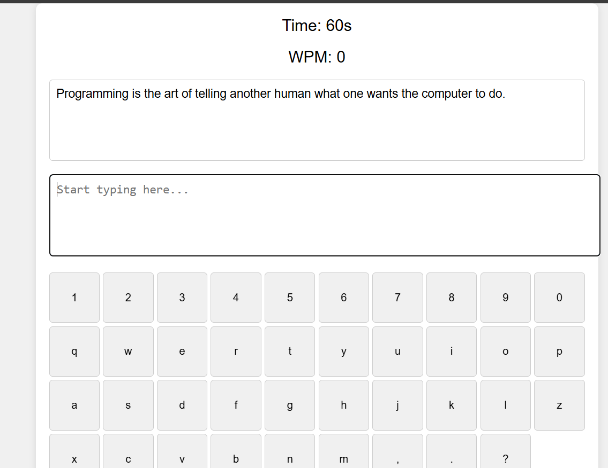
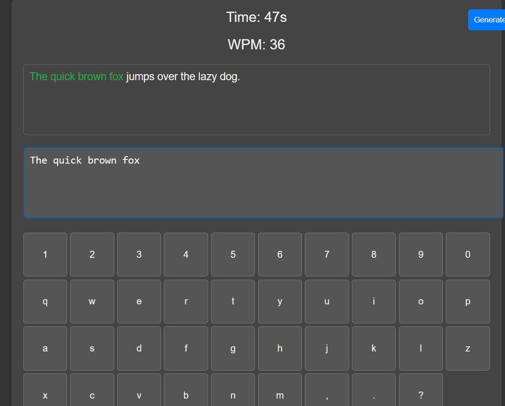
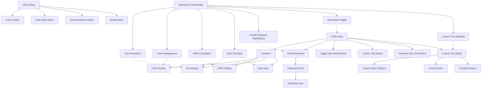

# Use gherkin to generate website by GPT-4o

## Prompt 1

```
# 打字練習網站需求說明書

## 一、概述

本需求說明書旨在描述一個以 HTML、CSS、JavaScript 開發的打字練習網站，讓使用者可以依照網站生成的文本或自己提供的文本進行打字練習。

## 二、功能描述

### 1. 主畫面設計

- **背景**: 提供亮色系與暗色系，切換按鈕在畫面右上方。
- **倒數計時**: 置於畫面上方，有倒數時間，結束時顯示WPM。
- **輸入框**: 置於畫面中上方，為輸入文字的位置。
- **文本畫面**: 置於畫面中間，輸入過並正確文字會從灰色變成黑色，錯誤的字會呈現紅色。畫面右上方有按鈕可以自行添加文本。(預設文本皆為英文)
- **鍵盤畫面**: 置於畫面中下方，顯示一個虛擬英文鍵盤，需依照正常鍵盤排版格式，每次按下按鍵時，虛擬鍵盤會點亮按下的按鍵。

### 2. 練習打字功能

- **切換背景**: 按下按鈕後切換背景顏色，預設為亮色系。
- **自動生成文本**: 自動生成文本提供使用者練習。
- **添加文本功能**: 按下按鈕後，跳出文本輸入畫面，有完成、取消按紐，讓使用者自己添加文本練習。
- **即時回饋**: 按下按鍵後，同時在鍵盤畫面顯示，並在文本畫面用顏色顯示是否正確。
- **計時功能**: 在按下第一個按鍵後開始計時， 完成文本後結束計時，並計算完成時間與WPM，顯示在畫面最上方。

## 三、技術要求

- **前端技術**：使用 HTML、CSS、JavaScript 實現所有功能。
- **相容性**：確保在主流瀏覽器（如 Chrome、Firefox、Safari）上正常運行。
- **使用者體驗**：
  - 界面友好，操作簡便。
  - 所有互動均需有明確的視覺反饋。

生成Gherkin的架構
```

```
Typing Practice Website Gherkin Specification
Feature: Main Screen Design
Scenario: User views the main screen
Given the user has opened the typing practice website
Then they should see a background with a light color scheme
And they should see a countdown timer at the top of the screen
And they should see an input box in the upper middle of the screen
And they should see a text display in the middle of the screen
And they should see a virtual keyboard at the bottom of the screen
And they should see a background toggle button in the top right corner
And they should see a custom text input button in the top right corner of the text display
Feature: Background Toggle
Scenario: User toggles background color
Given the user is on the main screen
When they click the background toggle button
Then the background should switch between light and dark color schemes
Feature: Typing Practice
Scenario: User starts typing practice
Given the user is on the main screen
When they start typing in the input box
Then the countdown timer should start
And the virtual keyboard should highlight the pressed keys
And the text display should update to show correct and incorrect inputs
Scenario: User completes typing practice
Given the user has finished typing the entire text
Then the countdown timer should stop
And the screen should display the completion time and WPM at the top
Feature: Custom Text Input
Scenario: User adds custom text for practice
Given the user is on the main screen
When they click the custom text input button
Then a text input screen should appear with "Complete" and "Cancel" buttons
When they enter custom text and click "Complete"
Then the text display should update with the custom text for practice
Feature: Automatic Text Generation
Scenario: Website generates text for practice
Given the user has just opened the website or completed a practice session
Then the website should automatically generate new text for practice
And display it in the text display area
Feature: Real-time Feedback
Scenario: User receives real-time feedback while typing
Given the user is typing in the input box
When they type a correct character
Then the corresponding character in the text display should turn from gray to black
When they type an incorrect character
Then the corresponding character in the text display should turn red
Feature: Browser Compatibility
Scenario Outline: Website works on different browsers
Given the user opens the website on <browser>
Then all features should function correctly
And the user interface should display properly
Examples:
| browser |
| Chrome  |
| Firefox |
| Safari  |
Feature: User Experience
Scenario: User interacts with website elements
Given the user is on the main screen
When they interact with any element on the page
Then they should receive clear visual feedback for their action

```

## Prompt2
以上是一份使用**gherkin**寫的需求書，幫我依照以上需求生成網頁，並給我完整程式碼。 + RAG file



## Prompt3
鍵盤的映射錯誤 按下什麼按鍵 就亮什麼按鍵
暗色模式的按鈕只更改了背景  應該要更改全部
缺少生成隨機文字的按鈕功能
請修正以上錯誤 並給我完整程式碼



## Prompt4
置於畫面中下方，顯示一個虛擬英文鍵盤，需依照正常鍵盤排版格式，每次按下按鍵時，虛擬鍵盤會點亮按下的按鍵。
目前這個功能沒有完成
請確認是否虛擬鍵盤會點亮按下的按鍵

## Prompt5
虛擬鍵盤的對應按鍵要在使用者按下按鍵後改變顏色或是其他可以觀察的反應
目前虛擬鍵盤的最後一個ROW的高度太大 請修正
請一次給我三個檔案html,css,js

## Prompt6
虛擬鍵盤還是沒有顯示出目前按下的按鍵 請重寫
虛擬鍵盤還是沒有顯示出目前按下的按鍵 請重寫
請一次給我三個獨立的檔案.html . css .js

## Conclusion 
表現還可以
在Prompt4完成大部分功能
在Prompt6完成全部功能

## mermaid
