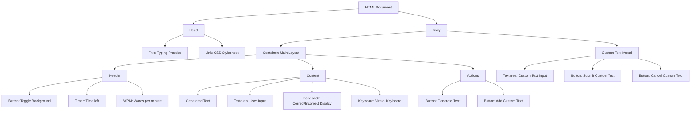

# Use gherkin to generate website by GPT-4o

## Prompt 1

```
# 打字練習網站需求說明書

## 一、概述

本需求說明書旨在描述一個以 HTML、CSS、JavaScript 開發的打字練習網站，讓使用者可以依照網站生成的文本或自己提供的文本進行打字練習。

## 二、功能描述

### 1. 主畫面設計

- **背景**: 提供亮色系與暗色系，切換按鈕在畫面右上方。
- **倒數計時**: 置於畫面上方，有倒數時間，結束時顯示WPM。
- **輸入框**: 置於畫面中上方，為輸入文字的位置。
- **文本畫面**: 置於畫面中間，輸入過並正確文字會從灰色變成黑色，錯誤的字會呈現紅色。畫面右上方有按鈕可以自行添加文本。(預設文本皆為英文)
- **鍵盤畫面**: 置於畫面中下方，顯示一個虛擬英文鍵盤，需依照正常鍵盤排版格式，每次按下按鍵時，虛擬鍵盤會點亮按下的按鍵。

### 2. 練習打字功能

- **切換背景**: 按下按鈕後切換背景顏色，預設為亮色系。
- **自動生成文本**: 自動生成文本提供使用者練習。
- **添加文本功能**: 按下按鈕後，跳出文本輸入畫面，有完成、取消按紐，讓使用者自己添加文本練習。
- **即時回饋**: 按下按鍵後，同時在鍵盤畫面顯示，並在文本畫面用顏色顯示是否正確。
- **計時功能**: 在按下第一個按鍵後開始計時， 完成文本後結束計時，並計算完成時間與WPM，顯示在畫面最上方。

## 三、技術要求

- **前端技術**：使用 HTML、CSS、JavaScript 實現所有功能。
- **相容性**：確保在主流瀏覽器（如 Chrome、Firefox、Safari）上正常運行。
- **使用者體驗**：
  - 界面友好，操作簡便。
  - 所有互動均需有明確的視覺反饋。

生成Gherkin的架構
```

```
Feature: Typing Practice Website

  Scenario: Background color toggle
    Given I am on the typing practice website
    When I click the "Toggle Background" button
    Then the background color should change between light and dark modes

  Scenario: Automatic text generation for practice
    Given I am on the typing practice website
    When I click the "Generate Text" button
    Then a practice text should be displayed in the text area

  Scenario: Adding custom text for practice
    Given I am on the typing practice website
    When I click the "Add Text" button
    Then a popup window should appear with a text input field
    And I should see "Submit" and "Cancel" buttons
    When I enter custom text in the input field
    And I click the "Submit" button
    Then the custom text should appear in the text area for practice

  Scenario: Typing feedback and key highlight
    Given I am on the typing practice website
    When I start typing in the input field
    Then the corresponding key on the virtual keyboard should highlight
    And typed characters in the text area should change color
    When the character is correct
    Then it should be displayed in black
    When the character is incorrect
    Then it should be displayed in red

  Scenario: Typing countdown and WPM calculation
    Given I am on the typing practice website
    When I start typing the practice text
    Then a countdown timer should start
    When I finish typing the text
    Then the timer should stop
    And the Words Per Minute (WPM) result should be displayed at the top of the screen

```

## Prompt2
以上是一份使用**gherkin**寫的需求書，幫我依照以上需求生成網頁，並給我完整程式碼。 
+ RAG file

## Prompt3
網頁有幾點需要做修改:

1.所有的按鈕都沒有作用
有切換深色模式按鈕
自訂文本按鈕
隨機產生文本按鈕
2.新增虛擬鍵盤
使用者按下後會及時反應
3.
輸入後會在題目上即時顯示
綠色正確 紅色為錯誤

幫我依照以上問題去做修改，並給我完整的程式碼。

## Prompt4
網頁有幾點需要做修改:

1.深色模式下新增自訂文本的區域也要是深色
2.輸入框下多了一行文字 這是多的
3.輸入後會在題目上即時顯示 綠色正確 紅色為錯誤 
4.下方的虛擬鍵盤 格局要跟真實鍵盤一樣

幫我依照以上問題去做修改，並給我完整的程式碼。

## Prompt5
網頁有幾點需要做修改:

1.題目上要及時顯示 與目前輸入比對的結果 綠色正確 紅色為錯誤 
2.鍵盤要正常反應 按什麼按鍵 就亮什麼按鍵 
3.整體版面需要優化 在新增自訂文本的地方 輸入格超出了範圍

幫我依照以上問題去做修改，並給我完整的程式碼。

## Prompt6
網頁有幾點需要做修改:

*1.題目上要及時顯示 與目前輸入比對的結果 綠色正確 紅色為錯誤  *
*2.鍵盤要正常反應 按什麼按鍵 就亮什麼按鍵 * 
*3.整體版面需要優化 在新增自訂文本的地方 輸入格超出了範圍 *
以上1,2,3點全部都沒有修正


## Prompt7
網頁有幾點需要做修改:

1.題目上要及時顯示 與目前輸入比對的結果 綠色正確 紅色為錯誤  
2.鍵盤要正常反應 按什麼按鍵 就亮什麼按鍵 
3.整體版面需要優化 在新增自訂文本的地方 輸入格超出了範圍 
請刪除目前的東西
跟據上面3點重寫一次

幫我依照以上問題去做修改，並給我完整的程式碼。


## Prompt8

請在我輸入後 題目顯示出跟目前的對比
虛擬鍵盤上要亮出我目前按下的按鍵

## Prompt9

比對錯誤 
不要多寫一行 請直接取代題目(生成的文字)

虛擬鍵盤上要亮出我目前按下的按鍵 這個功能完全沒有做到
請檢查目前亮的按鍵 是否跟 實際一樣


## Prompt10

比對錯誤 大小寫嚴格

生成的文本不要全大寫

暗色模式按鈕還是沒有用好

完成文本後沒有停下 並計算成績

新增自訂的地方也沒有修正排版


## Conclusion 
在prompt5~7
沒有完成需求 似乎已經定型了
連續問三次都還是同一份回應(修改完全沒有符合需求 且 修改幅度極小)

在8~9修改問法後有變好一點
成功修正了鍵盤亮燈問題 跟 題目亮色

在10次prompt後還是不能符合預計結果
宣告失敗

