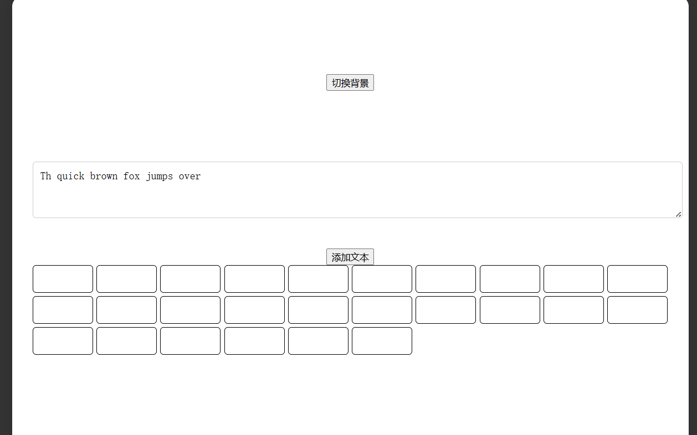
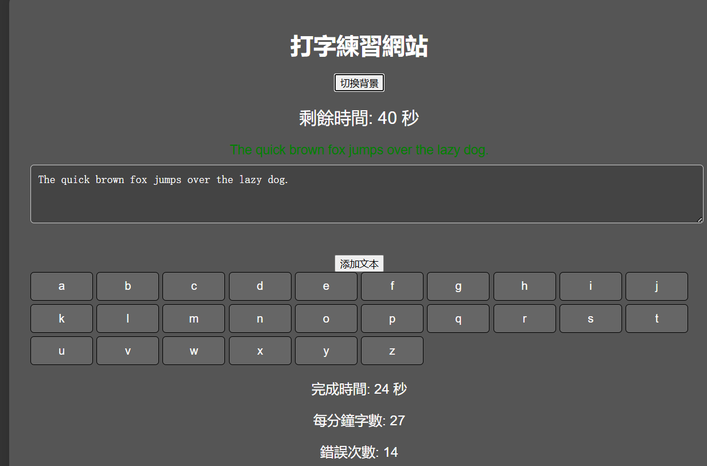
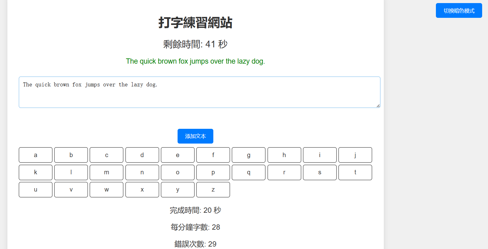
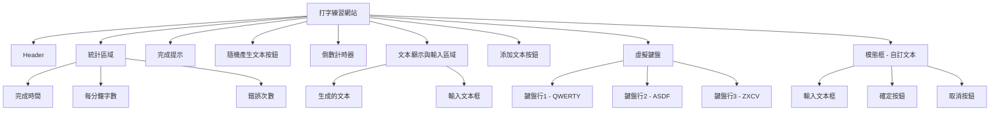

# Use natural language to generate website by GPT-4o

## Prompt 1

```
# 打字練習網站需求說明書

## 一、概述

本需求說明書旨在描述一個以 HTML、CSS、JavaScript 開發的打字練習網站，讓使用者可以依照網站生成的文本或自己提供的文本進行打字練習。

## 二、功能描述

### 1. 主畫面設計

- **背景**: 提供亮色系與暗色系，切換按鈕在畫面右上方。
- **倒數計時**: 置於畫面上方，有倒數時間，結束時顯示WPM。
- **輸入框**: 置於畫面中上方，為輸入文字的位置。
- **文本畫面**: 置於畫面中間，輸入過並正確文字會從灰色變成黑色，錯誤的字會呈現紅色。畫面右上方有按鈕可以自行添加文本。(預設文本皆為英文)
- **鍵盤畫面**: 置於畫面中下方，顯示一個虛擬英文鍵盤，需依照正常鍵盤排版格式，每次按下按鍵時，虛擬鍵盤會點亮按下的按鍵。

### 2. 練習打字功能

- **切換背景**: 按下按鈕後切換背景顏色，預設為亮色系。
- **自動生成文本**: 自動生成文本提供使用者練習。
- **添加文本功能**: 按下按鈕後，跳出文本輸入畫面，有完成、取消按紐，讓使用者自己添加文本練習。
- **即時回饋**: 按下按鍵後，同時在鍵盤畫面顯示，並在文本畫面用顏色顯示是否正確。
- **計時功能**: 在按下第一個按鍵後開始計時， 完成文本後結束計時，並計算完成時間與WPM，顯示在畫面最上方。

## 三、技術要求

- **前端技術**：使用 HTML、CSS、JavaScript 實現所有功能。
- **相容性**：確保在主流瀏覽器（如 Chrome、Firefox、Safari）上正常運行。
- **使用者體驗**：
  - 界面友好，操作簡便。
  - 所有互動均需有明確的視覺反饋。

幫我依照以上需求生成網頁，並給我完整程式碼。

以下是兩個範例
範例1
<!DOCTYPE html>
<html lang="en">
<head>
    <meta charset="UTF-8">
    <meta name="viewport" content="width=device-width, initial-scale=1.0">
    <title>Typing Challenge</title>
    <link rel="stylesheet" href="styles.css">
</head>
<body>
    <div class="container">
        <h1>Typing Challenge</h1>
        <div class="typing-area">
            <p id="generatedWord"></p>
            <textarea id="inputText" placeholder="Type the word here..."></textarea>
        </div>
        <div id="feedback"></div>
        <div id="result"></div>
        <div class="stats">
            <p>Time: <span id="timer">60</span> seconds</p>
            <p>Words per minute: <span id="wpm">0</span></p>
            <p>Errors: <span id="errors">0</span></p>
            <p>Attempts: <span id="attempts">0</span></p>
        </div>
    </div>
    <script src="script.js"></script>
</body>
</html>
const generatedWordElement = document.getElementById('generatedWord');
const inputTextElement = document.getElementById('inputText');
const feedbackElement = document.getElementById('feedback');
const resultElement = document.getElementById('result');
const timerElement = document.getElementById('timer');
const wpmElement = document.getElementById('wpm');
const errorsElement = document.getElementById('errors');
const attemptsElement = document.getElementById('attempts');

const wordList = ['apple', 'banana', 'orange', 'grape', 'watermelon', 'strawberry', 'blueberry', 'mango', 'cherry', 'pineapple'];
let generatedWord = '';
let timeLeft = 60;
let interval;
let totalErrors = 0;
let wordCount = 0;
let attemptsCount = 0;

// Initialize
generateRandomWord();
inputTextElement.addEventListener('keydown', handleEnter);

function startTimer() {
    interval = setInterval(() => {
        if (timeLeft > 0) {
            timeLeft--;
            timerElement.textContent = timeLeft;
        } else {
            clearInterval(interval);
            inputTextElement.disabled = true;
            calculateWPM();
        }
    }, 1000);
}

function handleEnter(event) {
    if (event.key === 'Enter') {
        event.preventDefault();  // Prevent default behavior (new line)

        const inputText = inputTextElement.value.trim();

        // Start the timer on first input
        if (wordCount === 0 && timeLeft === 60) {
            startTimer();
        }

        // Display the input result with color coding and increment attempts count
        displayResult(inputText);

        // Clear input field for the next word and generate a new random word
        inputTextElement.value = "";
        generateRandomWord();

        // Calculate words per minute (WPM)
        calculateWPM();
    }
}

function generateRandomWord() {
    const randomIndex = Math.floor(Math.random() * wordList.length);
    generatedWord = wordList[randomIndex];
    generatedWordElement.textContent = generatedWord;
}

function displayResult(inputText) {
    attemptsCount++;
    attemptsElement.textContent = attemptsCount;

    // Show only the latest result
    resultElement.innerHTML = `
        <p>Your input: <span class="${inputText === generatedWord ? 'correct' : 'incorrect'}">${inputText}</span></p>
        <p>Correct word: <span class="correct">${generatedWord}</span></p>
    `;

    // Update feedback and errors
    if (inputText === generatedWord) {
        feedbackElement.textContent = "Correct!";
        feedbackElement.style.color = "green";
        wordCount++;
    } else {
        feedbackElement.textContent = "Incorrect!";
        feedbackElement.style.color = "red";
        totalErrors++;
    }

    errorsElement.textContent = totalErrors;
}

function calculateWPM() {
    const timeSpent = 60 - timeLeft;
    const wpm = timeSpent > 0 ? (wordCount / timeSpent) * 60 : 0;
    wpmElement.textContent = Math.max(0, Math.round(wpm));
}
body {
    font-family: Arial, sans-serif;
    background-color: #f0f0f0;
    display: flex;
    justify-content: center;
    align-items: center;
    height: 100vh;
    margin: 0;
}

.container {
    background-color: #fff;
    padding: 30px;
    border-radius: 15px;
    box-shadow: 0 0 15px rgba(0, 0, 0, 0.1);
    text-align: center;
    width: 80%;
    max-width: 900px;
}

h1 {
    font-size: 2rem;
    margin-bottom: 20px;
}

.typing-area {
    display: flex;
    flex-direction: column;
    align-items: center;
}

#generatedWord {
    font-size: 24px;
    font-weight: bold;
    text-align: center;
    margin-bottom: 20px;
    color: #333;
}

textarea {
    width: 100%;
    height: 50px;
    font-size: 18px;
    padding: 10px;
    border-radius: 8px;
    border: 2px solid #ccc;
    resize: none;
}

textarea:focus {
    outline: none;
    border-color: #66afe9;
}

#feedback {
    margin-top: 20px;
    font-size: 18px;
}

#result {
    margin-top: 10px;
    font-size: 18px;
    white-space: pre-wrap;
    text-align: left;
}

.stats {
    margin-top: 20px;
    display: flex;
    justify-content: space-around;
    font-size: 18px;
}

.correct {
    color: green;
}

.incorrect {
    color: red;
}

範例2
<!DOCTYPE html>
<html lang="en">
<head>
  <meta charset="UTF-8">
  <meta name="viewport" content="width=device-width, initial-scale=1.0">
  <title>Typing Practice</title>
  <style>
    body {
      font-family: Arial, sans-serif;
      text-align: center;
      margin: 0;
      padding: 0;
    }
    .container {
      margin: 50px auto;
      width: 80%;
    }
    #timer {
      font-size: 24px;
      margin-bottom: 20px;
    }
    #textToType {
      font-size: 18px;
      margin-bottom: 20px;
      padding: 10px;
      border: 1px solid #ccc;
    }
    #inputText {
      width: 100%;
      height: 100px;
      font-size: 18px;
      border: 2px solid #000;
      padding: 10px;
      outline: none;
    }
    .correct {
      color: green;
    }
    .incorrect {
      color: red;
    }
    #result {
      font-size: 24px;
      color: blue;
      margin-top: 20px;
    }
  </style>
</head>
<body>
  <div class="container">
    <h1>Typing Practice</h1>
    <div id="timer">Time left: 60s</div>
    <div id="textToType">The quick brown fox jumps over the lazy dog.</div>
    <textarea id="inputText" placeholder="Start typing..." autofocus></textarea>
    <div id="result"></div>
  </div>

  <script>
    let timerElement = document.getElementById('timer');
    let inputText = document.getElementById('inputText');
    let textToType = document.getElementById('textToType').innerText;
    let resultElement = document.getElementById('result');
    let timeLeft = 60;
    
    // Start countdown timer
    let countdown = setInterval(function () {
      timeLeft--;
      timerElement.innerText = `Time left: ${timeLeft}s`;

      if (timeLeft <= 0) {
        clearInterval(countdown);
        inputText.disabled = true;
        resultElement.innerText = "Time's up!";
      }
    }, 1000);

    inputText.addEventListener('input', function () {
      let typedText = inputText.value;
      let displayText = '';
      let isCorrect = true;
      
      for (let i = 0; i < textToType.length; i++) {
        if (i < typedText.length) {
          if (typedText[i] === textToType[i]) {
            displayText += `<span class="correct">${textToType[i]}</span>`;
          } else {
            displayText += `<span class="incorrect">${textToType[i]}</span>`;
            isCorrect = false; // 出現錯誤字元
          }
        } else {
          displayText += textToType[i];
          isCorrect = false; // 尚未輸入完全
        }
      }

      let textToTypeElement = document.getElementById('textToType');
      textToTypeElement.innerHTML = displayText;

      // 如果完全正確，顯示結果並停用輸入框
      if (isCorrect && typedText.length === textToType.length) {
        clearInterval(countdown);
        resultElement.innerText = "恭喜！你完成了！";
        inputText.disabled = true;
      }
    });
  </script>
</body>
</html>

```





## Prompt 2

網頁有幾點需要做修改:

1.在切換到Dark Mode時，無法看到文字
2.完成時間:,每分鐘字數:,錯誤次數: 計算錯誤 請修正

幫我依照以上問題去做修改，並給我完整的程式碼。



## Prompt 3

網頁有幾點需要做修改:

1.切換暗色模式的按鈕應該在右上
2.美化排版 讓頁面方便閱讀
3.完成文本後要出現更明顯的完成

幫我依照以上問題去做修改，並給我完整的程式碼。



## Prompt 4

網頁有幾點需要做修改:

1.把目前的字母改成鍵盤配置
 **鍵盤畫面**: 置於畫面中下方，顯示一個虛擬英文鍵盤，需依照正常鍵盤排版格式
2.每次按下按鍵時，虛擬鍵盤會點亮按下的按鍵。
3.新增按鈕 按下後可以隨機產生文本
4.在暗色模式時 新增自訂文本的子頁面也應該是深色

幫我依照以上問題去做修改，並給我完整的程式碼。


## Prompt 5

網頁有幾點需要做修改:

1.目前的鍵盤配置還是錯的 請更改為正確的 鍵盤中的相對位置
2.新增自訂文本裡的取消按鈕無法運作
3.更新自訂文本後 也需要清空文字 重新進入測驗

幫我依照以上問題去做修改，並給我完整的程式碼。


## Prompt 6
網頁有幾點需要做修改:

1.虛擬鍵盤要跟鍵盤的配置一樣
QWE...
ASD...
ZXC...
2.目前的排版會導致下方的文字看不見 請更改排版

## Prompt 6
網頁有幾點需要做修改:

1.虛擬鍵盤每個字的框不見了
2.按下對應按鈕後 虛擬鍵盤要出現反應

幫我依照以上問題去做修改，並給我完整的程式碼。

## Prompt 7
網頁有幾點需要做修改:

1.更改版面配置 讓使用者不需要下滑也能看到
完成時間: 
每分鐘字數: 
錯誤次數: 
2.讓虛擬鍵盤 美觀一點
幫我依照以上問題去做修改，並給我完整的程式碼。


## Prompt 8
網頁有幾點需要做修改:

1.把恭喜你完成了 改到其他地方 目前的地方需要下滑才能看到


幫我依照以上問題去做修改，並給我完整的程式碼。

## Conclusion

RAG死了
問到第7次才完成基礎規定的內容
不確定是不是被RAG的內容搞
也可能是因為Rag的內容下錯


## mermaid



