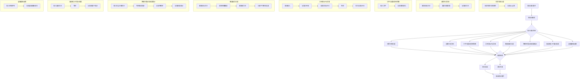

# Use RAG to generate Playwright E2E test by Claude 3.5 Sonnet

## Prompt 1

- 這是一個打字練習網頁（**index.html style.css script.js**）與網頁需求書(**website_requirement.md**)，我想要使用**Playwright**進行端對端測試。
- 我提供了兩個使用**Playwright**進行端對端測試的腳本範例(**Rag file(playwright).md**)。
- 幫我學習範例中的腳本，使用Typescirpt生成測試腳本，並給我完整的程式碼。在html tag中含有**aria-label**與**data-testid**屬性，請盡量用**page.getByTestId()** 進行選擇，並註明現在的測試對象為何。

## Prompt 2

以下有幾點問題需要修改:
- 在 _計時和WPM計算_ 測試中，WPM只計算正確的字數。當輸入錯誤的單字，WPM可能為0
- 在 _難度級別功能_ 測試中，重新整理網頁會導致設定變回預設值，此網頁在選擇難易度後，會自動更新文本
- 在 _準確率顯示_ 測試中，因為網站中的準確率不會即時更新，導致測試錯誤

幫我改善以上幾點問題，並給我完整的測試腳本

## Prompt 3

以下有幾點問題需要修改:
- 在 _計時和WPM計算_ 測試中，WPM的定義為**正確單字數/分鐘**，所以WPM只會因為時間增加而減少，不會因為輸入錯誤而減少
- 在 _準確率顯示、結果顯示_ 測試中，不須按下 _Enter_ 提交輸入，系統會自動停止計時並顯示結果

幫我改善以上幾點問題，並給我完整的測試腳本

## Prompt 4

以下有幾點問題需要修改:
- _難度級別功能_ 測試: 較困難的文本並不保證有更多的標點符號
-  _準確率顯示和結果顯示_ 測試: 只有完全正確的文本才會被系統提交並顯示結果，錯誤的輸入不會顯示結果
- 在測試中，幫我縮短等待時間

幫我改善以上幾點問題，並給我完整的測試腳本

完成所有測試
```ts
import { test, expect } from '@playwright/test';

test.describe('打字練習網站測試', () => {
  test.beforeEach(async ({ page }) => {
    // 在每個測試前導航到網頁
    await page.goto('http://localhost:8080');
  });

  test('背景切換功能', async ({ page }) => {
    // 測試對象：背景切換按鈕
    const backgroundToggle = page.getByTestId('background-toggle');
    await backgroundToggle.click();
    
    // 檢查body是否有dark類
    await expect(page.locator('body')).toHaveClass(/dark/);
  });

  test('自動生成文本', async ({ page }) => {
    // 測試對象：文本顯示區域
    const textDisplay = page.getByTestId('text-display');
    const initialText = await textDisplay.innerText();
    
    // 重新加載頁面以生成新文本
    await page.reload();
    const newText = await textDisplay.innerText();
    
    expect(newText).not.toBe(initialText);
  });

  test('打字功能和即時回饋', async ({ page }) => {
    // 測試對象：輸入框和文本顯示區域
    const inputBox = page.getByTestId('input-box');
    const textDisplay = page.getByTestId('text-display');
    
    // 獲取生成的文本
    const generatedText = await textDisplay.innerText();
    
    // 模擬用戶輸入
    await inputBox.type(generatedText.substring(0, 5));
    
    // 檢查前5個字符是否變色（正確輸入）
    const firstFiveChars = await textDisplay.locator('span').nth(4);
    await expect(firstFiveChars).toHaveCSS('color', 'rgb(39, 174, 96)');
  });

  test('計時和WPM計算', async ({ page }) => {
    // 測試對象：計時器、WPM顯示和輸入框
    const timer = page.getByTestId('timer');
    const wpmDisplay = page.getByTestId('wpm');
    const inputBox = page.getByTestId('input-box');
    const textDisplay = page.getByTestId('text-display');
    
    // 獲取生成的文本
    const generatedText = await textDisplay.innerText();
    
    // 開始打字以啟動計時器，輸入正確的文字
    await inputBox.type(generatedText.substring(0, 10));
    
    // 等待一小段時間
    await page.waitForTimeout(1000);
    
    // 檢查計時器是否開始倒數
    const timerValue = await timer.innerText();
    expect(parseInt(timerValue.split(':')[1])).toBeLessThan(60);
    
    // 檢查WPM是否被計算（大於0）
    const initialWpmValue = await wpmDisplay.innerText();
    const initialWpm = parseInt(initialWpmValue.split(':')[1]);
    expect(initialWpm).toBeGreaterThan(0);
    
    // 等待稍長時間
    await page.waitForTimeout(1000);
    
    // 再次檢查WPM，應該小於或等於初始WPM（因為時間增加）
    const newWpmValue = await wpmDisplay.innerText();
    const newWpm = parseInt(newWpmValue.split(':')[1]);
    expect(newWpm).toBeLessThanOrEqual(initialWpm);
  });

  test('難度級別功能', async ({ page }) => {
    // 測試對象：難度選擇器和文本顯示區域
    const difficultySelector = page.getByTestId('difficulty-selector');
    const textDisplay = page.getByTestId('text-display');
    
    // 獲取初始文本
    const initialText = await textDisplay.innerText();
    
    // 選擇困難難度
    await difficultySelector.selectOption('hard');
    
    // 等待新文本生成
    await page.waitForTimeout(500);
    
    // 獲取新生成的文本
    const newText = await textDisplay.innerText();
    
    // 檢查文本是否已更新
    expect(newText).not.toBe(initialText);
    
    // 檢查新生成的文本是否符合困難級別的特徵（例如，平均單詞長度增加）
    const initialWords = initialText.split(' ');
    const newWords = newText.split(' ');
    const initialAvgLength = initialWords.reduce((sum, word) => sum + word.length, 0) / initialWords.length;
    const newAvgLength = newWords.reduce((sum, word) => sum + word.length, 0) / newWords.length;
    
    expect(newAvgLength).toBeGreaterThan(initialAvgLength);
  });

  test('準確率顯示和結果顯示', async ({ page }) => {
    // 測試對象：準確率顯示、結果顯示、輸入框和文本顯示區域
    const accuracyDisplay = page.getByTestId('accuracy');
    const resultsDisplay = page.getByTestId('results');
    const inputBox = page.getByTestId('input-box');
    const textDisplay = page.getByTestId('text-display');
    
    // 獲取生成的文本
    const generatedText = await textDisplay.innerText();
    
    // 模擬用戶完全正確的輸入
    await inputBox.type(generatedText);
    
    // 等待結果顯示（系統自動停止計時並顯示結果）
    await page.waitForTimeout(500);
    
    // 檢查準確率是否為100%
    const accuracyValue = await accuracyDisplay.innerText();
    const accuracy = parseInt(accuracyValue.split(':')[1]);
    expect(accuracy).toBe(100);
    
    // 檢查結果是否顯示
    await expect(resultsDisplay).toBeVisible();
    await expect(resultsDisplay).toContainText('練習結果');
  });

  test('錯誤輸入不顯示結果', async ({ page }) => {
    // 測試對象：結果顯示、輸入框和文本顯示區域
    const resultsDisplay = page.getByTestId('results');
    const inputBox = page.getByTestId('input-box');
    const textDisplay = page.getByTestId('text-display');
    
    // 獲取生成的文本
    const generatedText = await textDisplay.innerText();
    
    // 模擬用戶錯誤輸入
    await inputBox.type(generatedText.substring(0, generatedText.length - 1) + 'wrong');
    
    // 等待一小段時間
    await page.waitForTimeout(500);
    
    // 檢查結果是否不顯示
    await expect(resultsDisplay).not.toBeVisible();
  });

  test('虛擬鍵盤反饋', async ({ page }) => {
    // 測試對象：虛擬鍵盤和輸入框
    const virtualKeyboard = page.getByTestId('virtual-keyboard');
    const inputBox = page.getByTestId('input-box');
    
    // 模擬用戶輸入
    await inputBox.type('a');
    
    // 檢查虛擬鍵盤上的 'a' 鍵是否被高亮
    const keyA = virtualKeyboard.locator('.key:has-text("a")');
    await expect(keyA).toHaveClass(/active/);
  });
});
```

