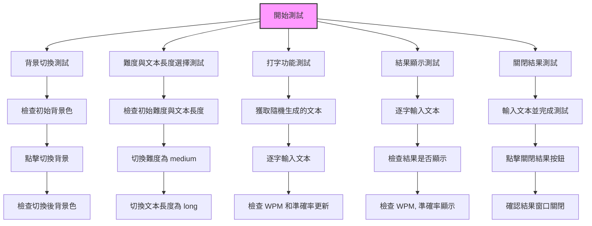

# Use RAG to generate Playwright E2E test by gpt-4o

## Prompt 1

- 這是一個打字練習網頁（**index.html style.css script.js**）與網頁需求書(**website_requirement.md**)，我想要使用**Playwright**進行端對端測試。
- 我提供了兩個使用**Playwright**進行端對端測試的腳本範例(**Rag file(playwright).md**)。
- 幫我學習範例中的腳本，使用Typescirpt生成測試腳本，並給我完整的程式碼。在html tag中含有**aria-label**與**data-testid**屬性，請盡量用**page.getByTestId()** 進行選擇，並註明現在的測試對象為何。


## Prompt 2

以下有幾點問題需要修改:
- WPM可能為0
- 只有完全正確 測試才會完成
幫我改善以上幾點問題，並給我完整的測試腳本


## Prompt 3

每次的文本是隨機產生
你必須針對每次的文字去調整你的測試內容

## Prompt 4

輸入的文字請一個一個輸入

## 完成

```
import { test, expect } from '@playwright/test';

test.describe('Typing Practice Website with dynamic text and per-character typing', () => {
  
  test('Background toggle changes colors', async ({ page }) => {
    await page.goto('http://localhost:8080');

    const backgroundToggle = await page.getByTestId('background-toggle');
    await expect(page.locator('body')).toHaveCSS('background-color', 'rgb(240, 240, 240)');
    
    await backgroundToggle.click();
    await expect(page.locator('body')).toHaveCSS('background-color', 'rgb(44, 62, 80)');
  });

  test('Select difficulty and length', async ({ page }) => {
    await page.goto('http://localhost:8080');

    const difficultySelector = await page.getByTestId('difficulty-selector');
    await expect(difficultySelector).toHaveValue('easy');
    await difficultySelector.selectOption('medium');
    await expect(difficultySelector).toHaveValue('medium');

    const lengthSelector = await page.getByTestId('length-selector');
    await expect(lengthSelector).toHaveValue('short');
    await lengthSelector.selectOption('long');
    await expect(lengthSelector).toHaveValue('long');
  });

  test('Typing test functionality with dynamic text (per-character input)', async ({ page }) => {
    await page.goto('http://localhost:8080');

    // 提取隨機生成的文本
    const textDisplay = await page.getByTestId('text-display');
    const generatedText = await textDisplay.innerText();

    // 確保生成的文本不是空的
    await expect(generatedText.length).toBeGreaterThan(0);

    // 模擬逐個字符輸入文本
    const inputBox = await page.getByTestId('input-box');
    await inputBox.click(); // 確保聚焦輸入框

    for (const char of generatedText) {
      await inputBox.type(char, { delay: 100 }); // 每次輸入一個字符，100ms 延遲
    }

    // 檢查 WPM 和 Accuracy 更新
    const wpmDisplay = await page.getByTestId('wpm');
    const accuracyDisplay = await page.getByTestId('accuracy');
    
    await page.waitForTimeout(2000); // 等待 2 秒進行 WPM 和準確率更新
    await expect(wpmDisplay).not.toHaveText('WPM: 0');
    await expect(accuracyDisplay).toHaveText(/準確率: \d+%/); // 確保顯示了準確率
  });

  test('Display results after typing test', async ({ page }) => {
    await page.goto('http://localhost:8080');

    // 提取隨機生成的文本
    const textDisplay = await page.getByTestId('text-display');
    const generatedText = await textDisplay.innerText();

    // 模擬逐個字符輸入文本
    const inputBox = await page.getByTestId('input-box');
    await inputBox.click(); // 確保聚焦輸入框

    for (const char of generatedText) {
      await inputBox.type(char, { delay: 100 }); // 每次輸入一個字符，100ms 延遲
    }

    // 確保結果顯示
    const resultTime = await page.getByTestId('result-time');
    await expect(resultTime).toBeVisible();
    
    const resultWpm = await page.getByTestId('result-wpm');
    await expect(resultWpm).toBeVisible();
    
    const resultAccuracy = await page.getByTestId('result-accuracy');
    await expect(resultAccuracy).toBeVisible();
  });

  test('Close results button functionality', async ({ page }) => {
    await page.goto('http://localhost:8080');

    // 提取隨機生成的文本並完成測試
    const textDisplay = await page.getByTestId('text-display');
    const generatedText = await textDisplay.innerText();
    
    const inputBox = await page.getByTestId('input-box');
    await inputBox.click(); // 確保聚焦輸入框

    for (const char of generatedText) {
      await inputBox.type(char, { delay: 100 }); // 每次輸入一個字符，100ms 延遲
    }

    // 點擊關閉結果按鈕
    const closeResults = await page.getByTestId('close-results');
    await closeResults.click();

    // 確認結果窗口已關閉
    const results = await page.getByTestId('results');
    await expect(results).toBeHidden();
  });

});

```

## mermaid

