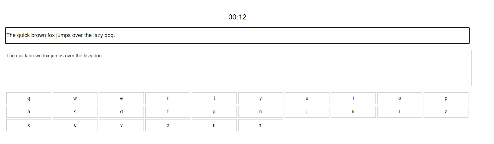
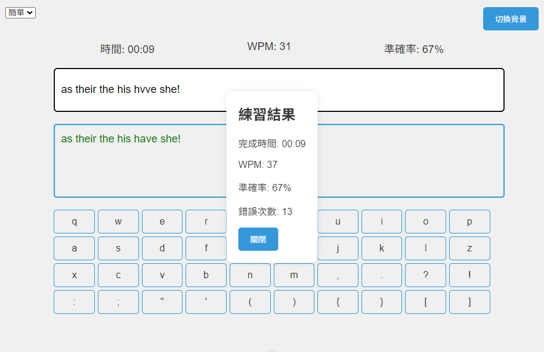
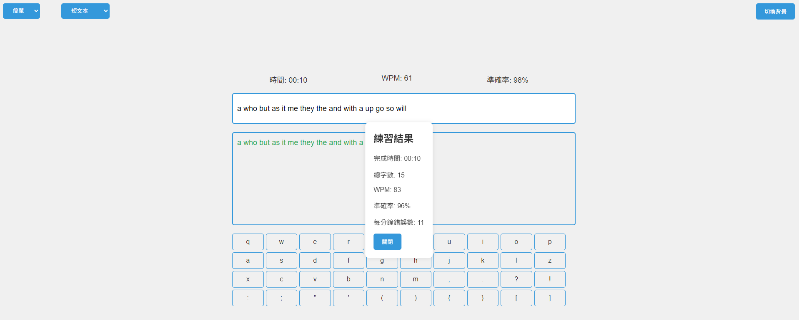
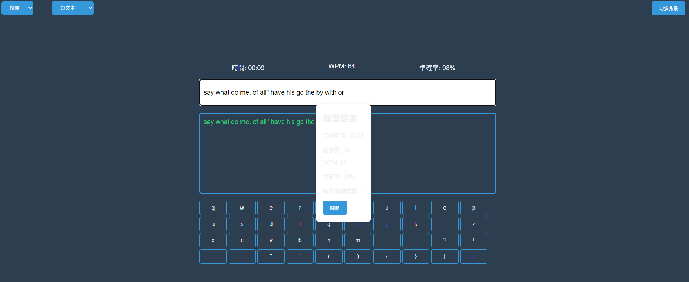
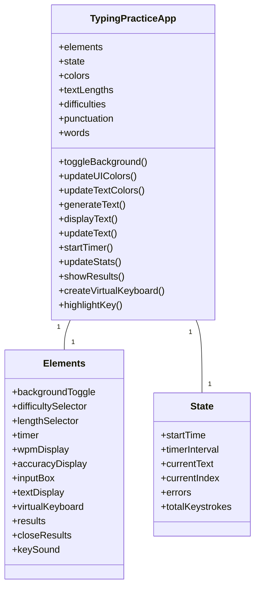
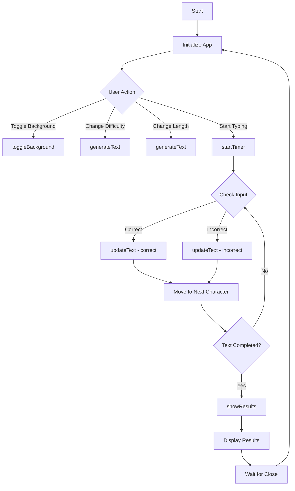
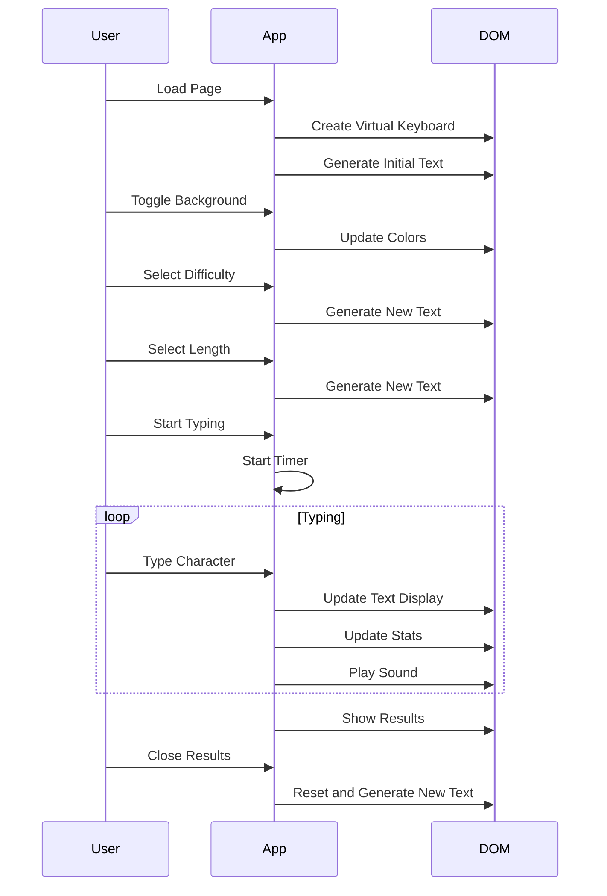

# Use gherkin to generate website by Claude 3.5 Sonnet

## Prompt 1

幫我依照```website_requirement.md```的需求用**gherkin**語法寫一份規格需求書

```
功能: 主畫面設計
  作為一個使用者
  我想要看到一個設計良好的主畫面
  以便我可以輕鬆地使用打字練習功能

  場景: 顯示主畫面元素
    假設 我打開打字練習網站
    那麼 我應該看到背景
    而且 我應該在畫面右上方看到背景切換按鈕
    而且 我應該在畫面上方看到倒數計時器
    而且 我應該在畫面中上方看到輸入框
    而且 我應該在畫面中間看到文本畫面
    而且 我應該在畫面中下方看到虛擬鍵盤

  場景: 顯示文本畫面
    假設 我正在查看文本畫面
    那麼 我應該看到預設的英文文本
    而且 我應該在右上方看到添加自定義文本的按鈕

  場景: 顯示虛擬鍵盤
    假設 我正在查看虛擬鍵盤
    那麼 我應該看到一個符合正常英文鍵盤排版的虛擬鍵盤

功能: 練習打字
  作為一個使用者
  我想要進行打字練習
  以便提高我的打字速度和準確性

  場景: 切換背景顏色
    假設 我在主畫面上
    當 我點擊背景切換按鈕
    那麼 背景顏色應該在亮色系和暗色系之間切換

  場景: 自動生成文本
    假設 我剛進入主畫面
    那麼 我應該看到自動生成的英文文本供練習使用

  場景: 添加自定義文本
    假設 我在主畫面上
    當 我點擊添加文本按鈕
    那麼 應該彈出文本輸入畫面
    而且 我應該看到完成和取消按鈕
    當 我輸入自定義文本並點擊完成
    那麼 文本畫面應該更新為我輸入的文本

  場景: 打字時的即時回饋
    假設 我開始打字
    當 我按下一個按鍵
    那麼 虛擬鍵盤上對應的按鍵應該點亮
    而且 如果輸入正確，文本畫面中對應的字應該從灰色變成黑色
    但是 如果輸入錯誤，文本畫面中對應的字應該變成紅色

  場景: 計時和計算WPM
    假設 我準備開始打字
    當 我按下第一個按鍵
    那麼 倒數計時器應該開始計時
    當 我完成整個文本
    那麼 計時器應該停止
    而且 畫面最上方應該顯示完成時間和WPM

功能: 技術實現
  作為開發者
  我想要確保網站符合技術要求
  以便提供良好的用戶體驗

  場景: 前端技術實現
    假設 我正在開發這個網站
    那麼 我應該只使用HTML、CSS和JavaScript來實現所有功能

  場景: 瀏覽器兼容性
    假設 網站已經開發完成
    那麼 它應該能在Chrome、Firefox和Safari等主流瀏覽器上正常運行

  場景: 用戶體驗
    假設 一個用戶正在使用這個網站
    那麼 他們應該發現界面友好且操作簡便
    而且 所有的互動都應該有明確的視覺反饋
```

以上是一份使用**gherkin**語法寫的需求書，幫我依照以上需求生成網頁，並給我完整程式碼。



## Prompt 2

網頁有下列幾點問題需要做修改:
1. 完成文本後，應該要停止計時，並顯示WPM。

網頁有下列幾點功能需要添加:
1. 虛擬鍵盤加入標點符號按鍵。
2. 實現更複雜的文本生成算法，而不是只有單一文本。
3. 添加難度級別選擇功能。
4. 改進UI/UX設計，使其更美觀。
5. 添加更多的打字統計信息，如準確率。
6. 添加聲音效果，以增強用戶體驗。

幫我照上述需求轉換成**gherkin**語法

```
功能: 主畫面設計
  作為一個使用者
  我想要看到一個設計良好且美觀的主畫面
  以便我可以輕鬆地使用打字練習功能

  場景: 顯示主畫面元素
    假設 我打開打字練習網站
    那麼 我應該看到一個美觀的背景
    而且 我應該在畫面右上方看到背景切換按鈕
    而且 我應該在畫面上方看到倒數計時器和WPM顯示區
    而且 我應該在畫面中上方看到輸入框
    而且 我應該在畫面中間看到文本畫面
    而且 我應該在畫面中下方看到包含標點符號的虛擬鍵盤
    而且 我應該看到難度級別選擇器

  場景: 顯示虛擬鍵盤
    假設 我正在查看虛擬鍵盤
    那麼 我應該看到一個符合正常英文鍵盤排版的虛擬鍵盤
    而且 虛擬鍵盤應該包含常用的標點符號按鍵

功能: 練習打字
  作為一個使用者
  我想要進行打字練習
  以便提高我的打字速度和準確性

  場景: 開始練習並計時
    假設 我準備開始打字
    當 我按下第一個按鍵
    那麼 倒數計時器應該開始計時
    而且 我應該聽到按鍵音效

  場景: 完成文本並顯示結果
    假設 我正在進行打字練習
    當 我完成整個文本
    那麼 計時器應該自動停止
    而且 畫面最上方應該顯示完成時間、WPM和準確率

  場景: 選擇難度級別
    假設 我在主畫面上
    當 我點擊難度級別選擇器
    那麼 我應該看到不同的難度選項
    當 我選擇一個難度級別
    那麼 生成的文本應該符合所選難度

  場景: 生成複雜文本
    假設 我選擇了一個難度級別
    當 系統生成新的練習文本
    那麼 文本應該根據選擇的難度級別而變化
    而且 每次生成的文本應該不同

功能: 用戶體驗增強
  作為一個使用者
  我想要有更好的打字體驗
  以便更享受練習過程並獲得更多反饋

  場景: 聽到按鍵音效
    假設 我正在進行打字練習
    當 我按下鍵盤上的任何鍵
    那麼 我應該聽到相應的按鍵音效

  場景: 查看詳細的打字統計信息
    假設 我完成了一次打字練習
    當 我查看結果頁面
    那麼 我應該看到WPM、準確率、錯誤次數等詳細統計信息

  場景: 體驗改進的UI/UX設計
    假設 我使用這個打字練習網站
    那麼 我應該注意到美觀的設計
    而且 所有元素的佈局應該直觀且易於使用
    而且 顏色方案應該舒適且吸引人

功能: 技術實現
  作為開發者
  我想要確保網站符合技術要求並提供出色的用戶體驗
  以便吸引更多用戶使用我們的打字練習網站

  場景: 前端技術實現
    假設 我正在開發這個網站
    那麼 我應該只使用HTML、CSS和JavaScript來實現所有功能
    而且 我應該實現一個複雜的文本生成算法以提供多樣化的練習內容

  場景: 瀏覽器兼容性
    假設 網站已經開發完成
    那麼 它應該能在Chrome、Firefox和Safari等主流瀏覽器上正常運行
    而且 所有新增的功能，包括音效，都應該在這些瀏覽器中正常工作

  場景: 用戶體驗
    假設 一個用戶正在使用這個網站
    那麼 他們應該發現界面友好且操作簡便
    而且 所有的互動都應該有明確的視覺和聽覺反饋
    而且 用戶應該能夠輕鬆地選擇難度級別並獲得適合的練習內容
```

網頁有幾點需要做修改，幫我依照上述需求完成，並給我完整程式碼。



## Prompt 3

網頁有下列幾點問題需要做修改:
1. 切換背景後的練習結果顏色顯示不夠清楚
2. 少了聲音效果，聲音來源可能有問題

網頁有下列幾點功能需要添加:
1. 更長的文本，提供用戶練習

幫我照上述需求轉換成**gherkin**語法

```
功能: 主畫面設計與背景切換
  作為一個使用者
  我想要在不同背景下都能清晰地看到練習結果
  以便在任何顯示模式下都能有效地練習打字

  場景: 切換背景並確保結果顯示清晰
    假設 我在主畫面上
    當 我點擊背景切換按鈕
    那麼 背景顏色應該在亮色系和暗色系之間切換
    而且 無論是哪種背景，練習結果的顏色都應該清晰可見
    
  場景: 在暗色背景下檢查結果顯示
    假設 我已切換到暗色背景
    當 我完成一次打字練習
    那麼 正確輸入的文字應該以明顯區別於背景的顏色顯示
    而且 錯誤輸入的文字應該以另一種醒目的顏色顯示
    而且 未輸入的文字應該以第三種易於辨識的顏色顯示

  場景: 在亮色背景下檢查結果顯示
    假設 我已切換到亮色背景
    當 我完成一次打字練習
    那麼 正確輸入的文字應該以明顯區別於背景的顏色顯示
    而且 錯誤輸入的文字應該以另一種醒目的顏色顯示
    而且 未輸入的文字應該以第三種易於辨識的顏色顯示

功能: 聲音效果
  作為一個使用者
  我想要在打字時聽到清晰的聲音反饋
  以增強我的打字體驗並提供額外的感官刺激

  場景: 確保聲音效果正常播放
    假設 我已開啟網頁的聲音
    當 我開始打字
    那麼 每次按鍵都應該產生相應的聲音效果
    而且 聲音應該清晰無雜音

  場景: 檢查聲音文件來源
    假設 我是網站的開發者
    當 我檢查網站的音頻文件
    那麼 所有聲音文件都應該從可靠的來源加載
    而且 音頻文件的格式應該被所有主流瀏覽器支持

功能: 提供更長的練習文本
  作為一個想要進行長時間練習的使用者
  我想要有更長的文本選項
  以便進行更持久和全面的打字練習

  場景: 選擇長文本練習
    假設 我在主畫面上
    當 我選擇文本長度選項
    那麼 我應該看到包括"短文本"、"中等文本"和"長文本"的選項
    當 我選擇"長文本"選項
    那麼 系統應該生成一個顯著長於之前文本的練習內容

  場景: 完成長文本練習
    假設 我已選擇長文本練習
    當 我開始打字
    那麼 文本應該分段顯示，便於閱讀
    而且 我應該能夠通過滾動查看整個文本
    當 我完成整個長文本
    那麼 系統應該顯示完整的練習時間、總字數和WPM

功能: 練習打字
  作為一個使用者
  我想要進行各種長度的打字練習
  以全面提高我的打字速度和準確性

  場景: 選擇不同長度的文本
    假設 我在主畫面上
    當 我點擊文本長度選擇器
    那麼 我應該看到不同的長度選項，包括短、中、長文本
    當 我選擇一個長度
    那麼 生成的文本應該符合所選長度

  場景: 完成長文本並顯示詳細結果
    假設 我正在進行長文本打字練習
    當 我完成整個文本
    那麼 計時器應該自動停止
    而且 畫面應該顯示完成時間、總字數、WPM、準確率和每分鐘錯誤數

功能: 技術實現
  作為開發者
  我想要確保網站所有功能正常運作並提供出色的用戶體驗
  以確保用戶能夠進行高質量的打字練習

  場景: 優化音頻實現
    假設 我正在開發這個網站
    那麼 我應該確保所有音頻文件來源可靠且格式兼容
    而且 我應該實現高效的音頻加載和播放機制

  場景: 實現長文本功能
    假設 我正在實現長文本功能
    那麼 我應該開發一個能夠生成或載入長篇幅文本的機制
    而且 我應該確保長文本的顯示和滾動功能流暢運作

  場景: 優化顏色顯示
    假設 我正在調整網站的顏色方案
    那麼 我應該為亮色和暗色背景模式設計對比度適宜的顏色方案
    而且 我應該確保在所有背景模式下，文字顯示清晰可辨
```

網頁有幾點需要做修改，幫我依照上述需求完成，並給我完整程式碼。




## Conclusion

**gherkin**的結果比**natural language**還要好，而且
下了兩次prompt就做完了，有點東西。

## Mermaid





