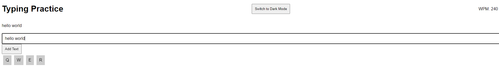
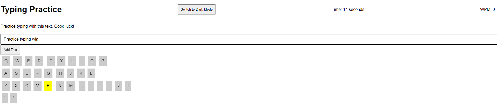
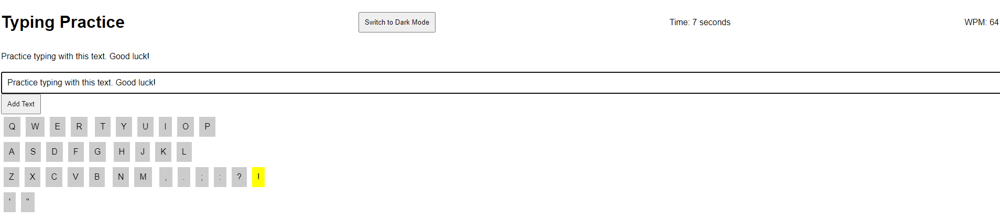
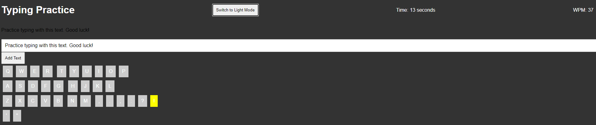
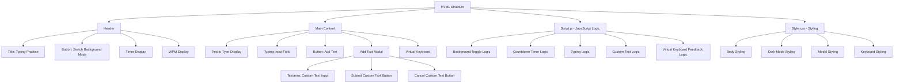

# Use gherkin to generate website by GPT-4o

## Prompt 1

幫我依照```website_requirement.md```的需求用**gherkin**寫一份規格書

```
Feature: Typing Practice Website

  Scenario: User changes the background theme
    Given the website is loaded
    When the user clicks the "Switch Background" button
    Then the background theme should toggle between light and dark modes
    And the button should indicate the current mode

  Scenario: User starts typing practice
    Given the website displays a default text for typing practice
    When the user presses the first key
    Then the timer should start counting down
    And the correct letters typed should turn black
    And the incorrect letters should turn red

  Scenario: User adds a custom text for typing practice
    Given the website displays an "Add Text" button
    When the user clicks the "Add Text" button
    Then a modal should appear with a text input field
    And the user should be able to input custom text
    And the user can click "Submit" to save the custom text
    Or the user can click "Cancel" to close the modal without saving

  Scenario: Virtual keyboard feedback
    Given the user is typing in the input field
    When a key is pressed
    Then the corresponding key on the virtual keyboard should light up

  Scenario: Display typing speed (WPM) after completing the text
    Given the user finishes typing the provided text
    When the last character is typed
    Then the timer should stop
    And the website should calculate the words per minute (WPM)
    And display the WPM at the top of the screen
```

以上是一份使用**gherkin**寫的需求書，幫我依照以上需求生成網頁，並給我完整程式碼。



## Prompt 2

網頁有下列幾點需要做修改:
1. 少了倒數計時功能，需要在使用者第一次輸入時開始計時，完成文本後停止計時
2. 虛擬鍵盤需要顯示所有的英文字母與標點符號，現在只有 _QWER_
3. 當輸入正確時，文本區域的字母需要變成黑色。輸入錯誤時，文本區域的字母需要變成紅色，而不是在打字區域
4. 少了自動生成文本功能，此功能應該要在網頁啟動時自動生成，而不是一個按鈕功能

幫我照上述需求轉換成**gherkin**語法

```
Feature: Typing Practice Website Enhancements

  Scenario: Countdown timer starts and stops with typing
    Given the website displays a text for typing practice
    When the user presses the first key
    Then the countdown timer should start
    And when the user finishes typing the text
    Then the countdown timer should stop
    And the website should display the total time and WPM at the top of the screen

  Scenario: Virtual keyboard displays all letters and punctuation
    Given the website loads the typing practice page
    When the user views the virtual keyboard
    Then the virtual keyboard should display all alphabet letters (A-Z)
    And it should include common punctuation symbols such as . , ; : ? ! ' "

  Scenario: Text area changes color based on correct or incorrect input
    Given the user is typing in the input field
    When the user types a correct character
    Then the corresponding character in the text area should turn black
    When the user types an incorrect character
    Then the corresponding character in the text area should turn red

  Scenario: Automatically generate a typing text upon page load
    Given the user opens the typing practice page
    When the page loads
    Then the website should automatically generate a default text for the user to practice typing
    And the user should be able to start typing without pressing any button
```

網頁有幾點需要做修改，幫我依照上述需求完成，並給我完整程式碼。



## Prompt 3

網頁有下列幾點需要做修改:
1. 倒數計時功能需要在每次開始文本都計時，而不是只有第一次
2. 文本最後一個字輸入錯誤時，倒數計時不應該停止
3. WPM計算好像有誤，正常打字不會到1000以上
4. 在**Light Mode**無法明確區分打字與未打字的區別，我想要有明確的區別

幫我照上述需求轉換成**gherkin**語法

```
Feature: Typing Practice Website Updates

  Scenario: Countdown timer starts with every typing session
    Given the website displays a text for typing practice
    When the user presses the first key of a new text
    Then the countdown timer should start
    And when the user finishes typing the text
    Then the countdown timer should stop
    And the website should display the total time and WPM at the top of the screen

  Scenario: Countdown timer continues when last character is incorrect
    Given the user is typing the last character of the text
    When the user types an incorrect character
    Then the countdown timer should not stop
    And the user can continue typing until the correct character is entered

  Scenario: Accurate WPM calculation
    Given the user has finished typing the text
    When the website calculates WPM
    Then the WPM should be calculated accurately based on total characters and time spent
    And the WPM value should not exceed reasonable limits (e.g., less than 1000 WPM for normal typing)

  Scenario: Clear distinction between typed and untyped text in Light Mode
    Given the user is in Light Mode
    When the user starts typing the text
    Then the typed characters should be clearly distinguished from the untyped characters
    And the typed characters should have a strong contrast against the untyped text to ensure clarity
```

網頁有幾點需要做修改，幫我依照上述需求完成，並給我完整程式碼。




## Conclusion

使用**gherkin**生成出的程式並沒有比**natural language**來的好，多下了一次prompt。在生成**gherkin**時，LLM可能會理解錯誤，導致提供了錯誤的需求生成程式碼。

## Mermaid

