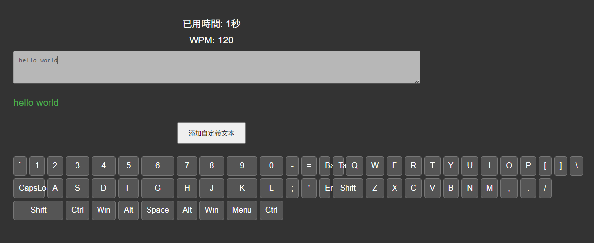
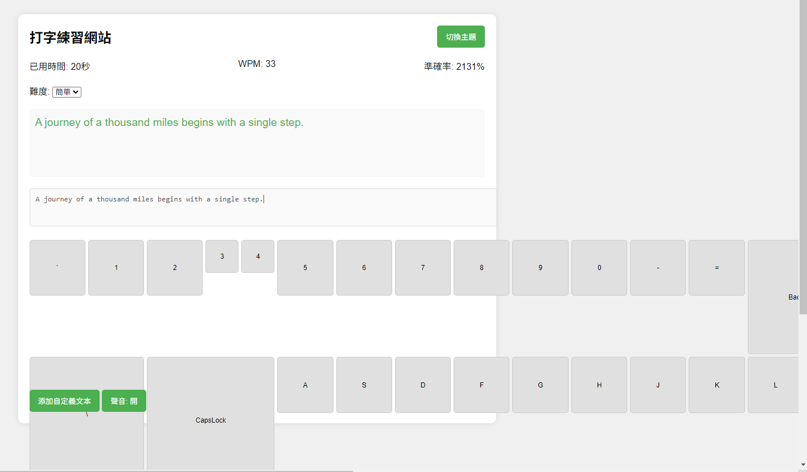
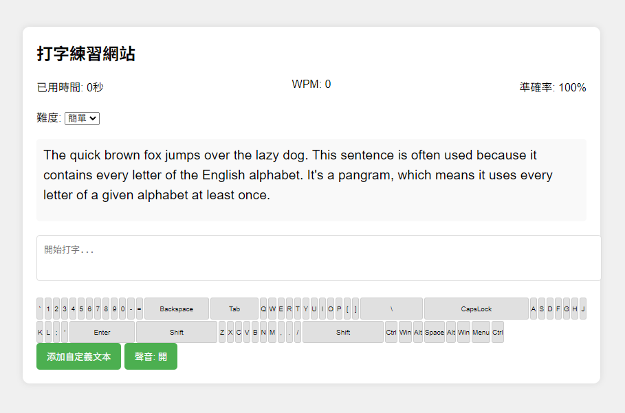
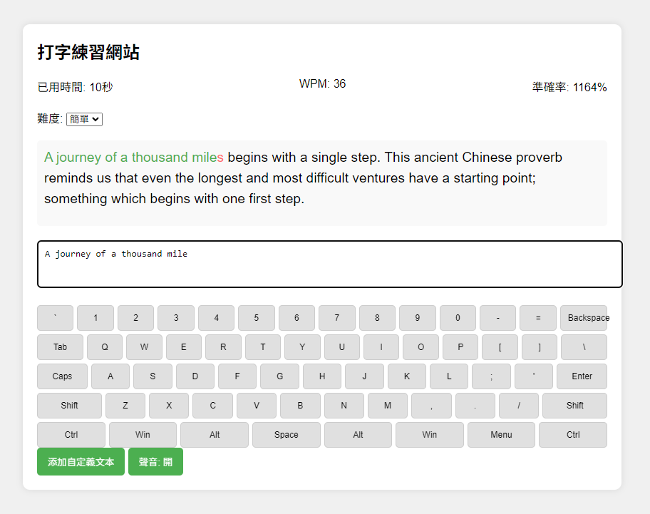
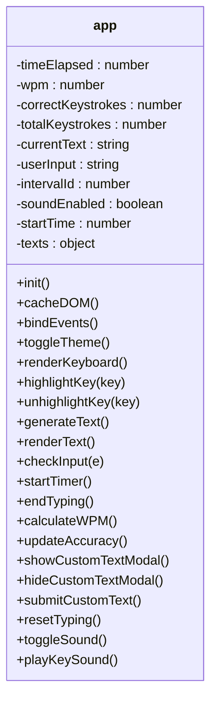

# Use natural language to generate website by Claude 3.5 Sonnet

## Prompt 1

幫我依照website_requirement.md的需求生成網頁，並給我完整程式碼。

## Prompt 2

網頁有以下幾點問題需要修改:
1. 即時回饋功能沒有正常顯示，正確和錯誤的輸入會以不同顏色顯示，正確為黑色、錯誤為紅色。
2. 虛擬鍵盤沒有依照真實的鍵盤排版，按鍵的順序對了可是相對位置有錯。
3. 在測試發現，計時器有遇到變為負數的情況，可以改為以正數的方式計時，文本完成後停止。
4. 在**Dark Mode**下，虛擬鍵盤的顏色選擇沒有很好，看不太清楚。

幫我依照上述問題去做修改，並給我完整的程式碼。

## Prompt 3

網頁有以下幾點問題需要修改:
1. 在**Light Mode**下，輸入正確的即時回饋並沒有顯示，因為文本已經是黑色的。
2. 鍵盤格式明顯跑掉，字體超出框線，並且布局錯誤。

網頁有以下幾點功能需要添加:
1. 實現更複雜的文本生成算法，而不是只有單一文本。
2. 添加難度級別選擇功能。
3. 改進UI/UX設計，使其更美觀。
4. 添加更多的打字統計信息，如準確率。
5. 添加聲音效果，以增強用戶體驗。

幫我依照上述需求去做修改，並給我完整的程式碼。

## Prompt 4

網頁有以下幾點問題需要修改:
1. 虛擬鍵盤格式跑版，且按鍵形狀太大。
2. 聲音效果好像沒有呈現。
3. 準確率計算有誤，數字總是大於100%，不合理。

網頁有以下幾點功能需要添加:
1. 更長的文本，提供使用者練習。

幫我依照上述需求去做修改，並給我完整的程式碼。

## Prompt 5

網頁有以下幾點問題需要修改:
1. 虛擬鍵盤格式布局有問題。
2. 準確率計算有誤，輸入錯誤並沒有降低準確率。
3. 計時速度有問題，並非正常秒數。

幫我依照上述需求去做修改，並給我完整的程式碼。

## Conclusion

除了計算準確率以外，其餘功能都有正常完成，比較常遇到鬼打牆的問題，可能是prompt沒下好導致。

## Mermaid

```mermaid
graph TD
    A[app] --> B[Properties]
    A --> C[Methods]
    
    B --> B1[timeElapsed]
    B --> B2[wpm]
    B --> B3[correctKeystrokes]
    B --> B4[totalKeystrokes]
    B --> B5[currentText]
    B --> B6[userInput]
    B --> B7[intervalId]
    B --> B8[soundEnabled]
    B --> B9[startTime]
    B --> B10[texts]

    C --> C1[Initialization]
    C --> C2[UI Handling]
    C --> C3[Text Handling]
    C --> C4[Input Processing]
    C --> C5[Statistics]
    C --> C6[Modal Handling]
    C --> C7[Sound Control]

    C1 --> C1_1[init]
    C1 --> C1_2[cacheDOM]
    C1 --> C1_3[bindEvents]

    C2 --> C2_1[toggleTheme]
    C2 --> C2_2[renderKeyboard]
    C2 --> C2_3[highlightKey]
    C2 --> C2_4[unhighlightKey]

    C3 --> C3_1[generateText]
    C3 --> C3_2[renderText]

    C4 --> C4_1[checkInput]
    C4 --> C4_2[startTimer]
    C4 --> C4_3[endTyping]

    C5 --> C5_1[calculateWPM]
    C5 --> C5_2[updateAccuracy]

    C6 --> C6_1[showCustomTextModal]
    C6 --> C6_2[hideCustomTextModal]
    C6 --> C6_3[submitCustomText]

    C7 --> C7_1[toggleSound]
    C7 --> C7_2[playKeySound]

    C --> C8[resetTyping]
```

