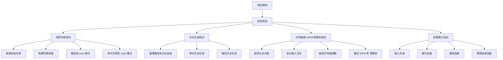
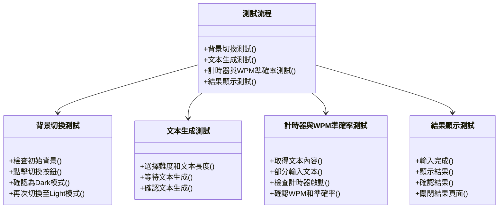

# Generate Playwright E2E test by gpt-4o

## Prompt 1
這是一個打字練習網頁（**index.html style.css script.js**）與網頁需求書(**website_requirement.md**)，我想要使用**Playwright**進行端對端測試，幫我使用Typescirpt生成測試腳本，並給我完整的程式碼。在html tag中含有**aria-label**與**data-testid**屬性，請盡量用**page.getByTestId()** 進行選擇，並註明現在的測試對象為何。

## Prompt 2
在 _should start the timer and track WPM and accuracy during typing_ 測試中，輸入 _a quick brown fox_ 但文本中沒有符合的單字時，WPM和準確率可能為0，不能以一定大於零來測試。幫我改善這個問題，並給我完整的程式碼。

順利完成測試

```ts
import { test, expect } from '@playwright/test';

test.describe('Typing Practice Website', () => {

  test('should toggle background color when clicking the toggle button', async ({ page }) => {
    await page.goto('http://localhost:8080');
    const backgroundToggle = page.getByTestId('background-toggle');
    const body = page.locator('body');

    await expect(body).toHaveCSS('background-color', 'rgb(240, 240, 240)'); // light mode color
    await backgroundToggle.click();
    await expect(body).toHaveCSS('background-color', 'rgb(44, 62, 80)'); // dark mode color
    await backgroundToggle.click();
    await expect(body).toHaveCSS('background-color', 'rgb(240, 240, 240)');
  });

  test('should generate text based on difficulty and length selections', async ({ page }) => {
    await page.goto('http://localhost:8080');
    const difficultySelector = page.getByTestId('difficulty-selector');
    const lengthSelector = page.getByTestId('length-selector');
    const textDisplay = page.getByTestId('text-display');

    await difficultySelector.selectOption('medium');
    await lengthSelector.selectOption('long');
    await page.waitForTimeout(1000); // 等待文本更新

    const generatedText = await textDisplay.textContent();
    expect(generatedText?.length).toBeGreaterThan(0);
  });

  test('should start the timer and track WPM and accuracy during typing', async ({ page }) => {
    await page.goto('http://localhost:8080');
    
    // 取得要輸入的文本
    const textDisplay = page.getByTestId('text-display');
    const inputText = await textDisplay.textContent();

    // 確保文本存在且非空
    expect(inputText).toBeTruthy();
    
    // 選擇文本框
    const inputBox = page.getByTestId('input-box');
    const timer = page.getByTestId('timer');
    const wpmDisplay = page.getByTestId('wpm');
    const accuracyDisplay = page.getByTestId('accuracy');

    // 開始輸入前，確認計時器顯示為初始值
    await expect(timer).toHaveText('時間: 00:00');
    
    // 輸入文本的前幾個字符
    const textToType = inputText?.slice(0, 10) ?? ''; // 取文本的前 10 個字符
    await inputBox.type(textToType);

    // 輸入後，應該啟動計時器
    await expect(timer).not.toHaveText('時間: 00:00');

    // 確認 WPM 和 準確率顯示已更新
    const wpm = await wpmDisplay.textContent();
    const accuracy = await accuracyDisplay.textContent();

    // WPM 和 準確率應在合理範圍內，準確率不為 0，WPM 可能是 0 但不應顯示為 NaN
    expect(Number(accuracy?.split(' ')[1].replace('%', ''))).toBeLessThanOrEqual(100);
    expect(wpm).not.toBe('WPM: NaN');
  });

  test('should display results after typing is complete', async ({ page }) => {
    await page.goto('http://localhost:8080');
    const inputBox = page.getByTestId('input-box');
    const textDisplay = page.getByTestId('text-display');
    const resultTime = page.getByTestId('result-time');
    const resultWords = page.getByTestId('result-words');
    const resultWpm = page.getByTestId('result-wpm');
    const resultAccuracy = page.getByTestId('result-accuracy');
    const closeResults = page.getByTestId('close-results');

    const textToType = await textDisplay.textContent();
    if (textToType) {
      await inputBox.type(textToType);
    }

    await expect(resultTime).toBeVisible();
    await expect(resultWords).toBeVisible();
    await expect(resultWpm).toBeVisible();
    await expect(resultAccuracy).toBeVisible();
    await closeResults.click();
    await expect(resultTime).not.toBeVisible();
  });

});
```



