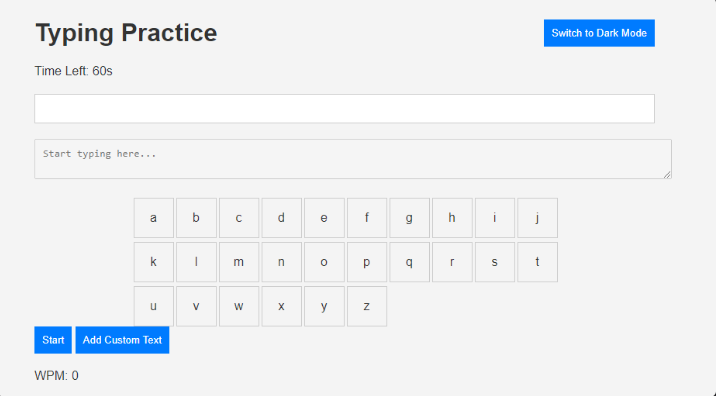
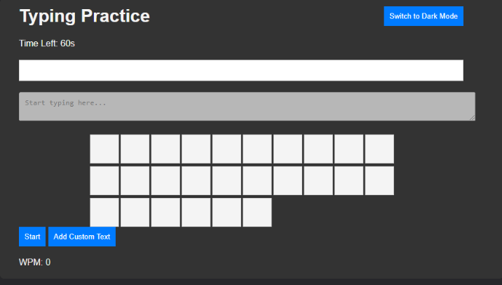
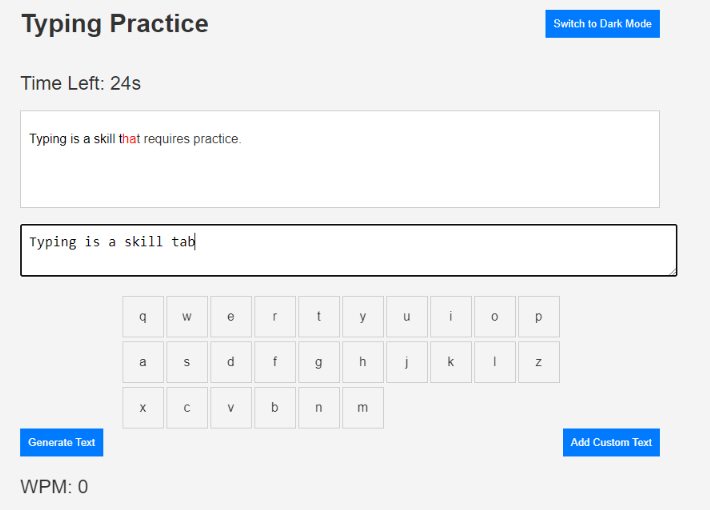
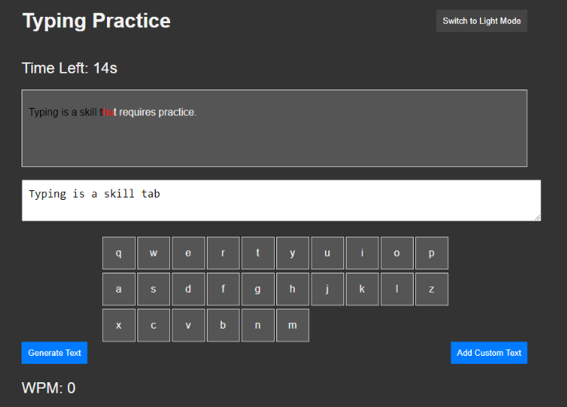
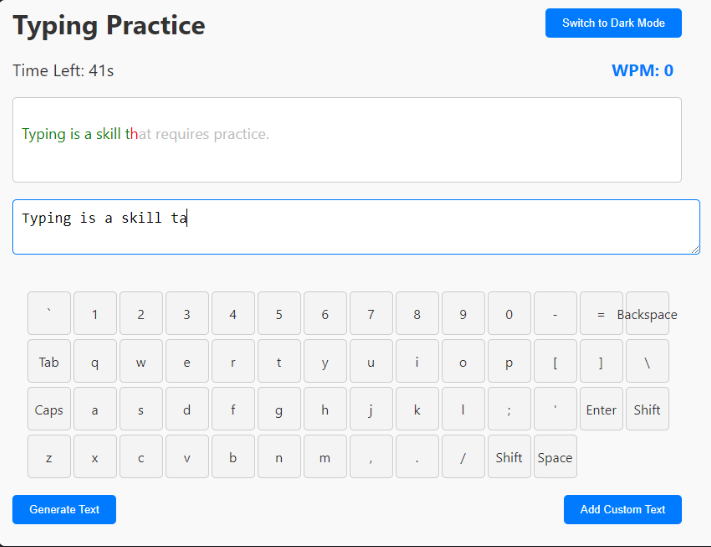
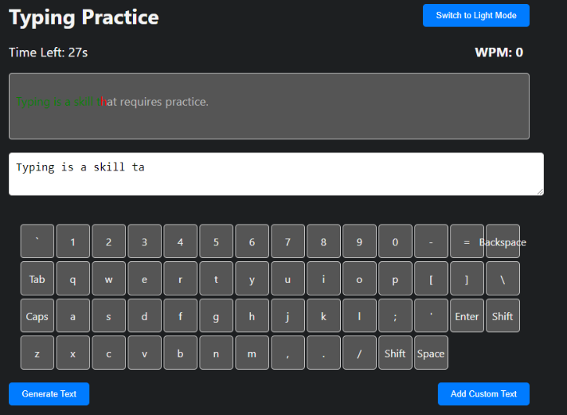
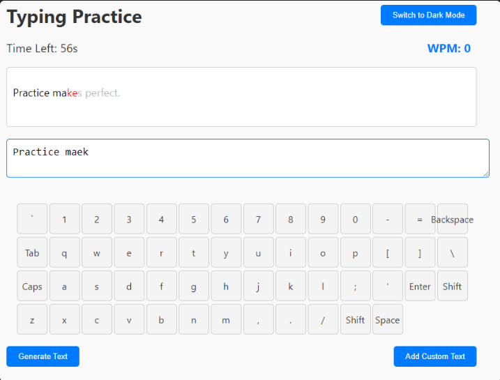

# Generate website with GPT-4o
## Prompt 1

幫我依照website_requirement.md需求生成網頁，並給我完整程式碼。

## Prompt 2

網頁有幾點需要做修改

1. 右上角的**Switch to Dark Mode**按鈕，在被按下之後，應該顯示**Switch to Light Mode**
2. 在切換到**Dark Mode**時，無法看到鍵盤上的字母
3. 需要在使用者按下鍵盤後，自動開始倒數計時。在完成文本後，自動停止計時，並顯示當下WPM
4. 少了自動生成文本功能
5. **Add Custom Text**的UI顯示有問題

幫我依照以上問題去做修改，並給我完整的程式碼。

## Prompt 3

功能大致已經完成，但我想修改幾項UI上的設定:
1. **Time Left**跟**WPM**皆放在畫面上方並排置中
2. 在**Light Mode**中，輸入與沒輸入的文字差異不大，我想要更明顯的區分
3. 虛擬鍵盤的按鍵順序需符合實際鍵盤排版格式，包括標點符號等
4. 放置文本的容器可以縮小
5. 我想對整體的UI進行美化，讓它看起來更舒適

## Prompt 4

1. **Enter**右邊不應該是**Shift**
2. **Backspace**超出了按鍵範圍
3. 按下**Space**後沒有反應
4. 我想讓輸入正確的文字變成黑色

## Conclusion

基本上只下了兩次prompt，就完成了所有功能，剩下兩次是UI上的調整，雖然最後沒有完成需求，但已經是一個合格的網頁了。