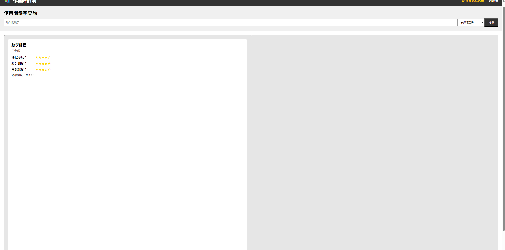
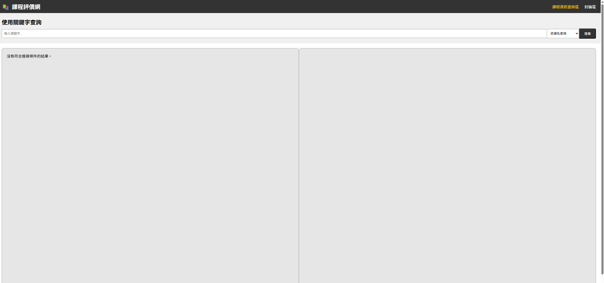
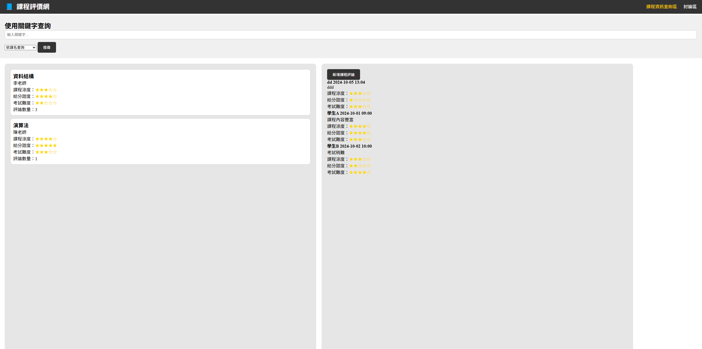
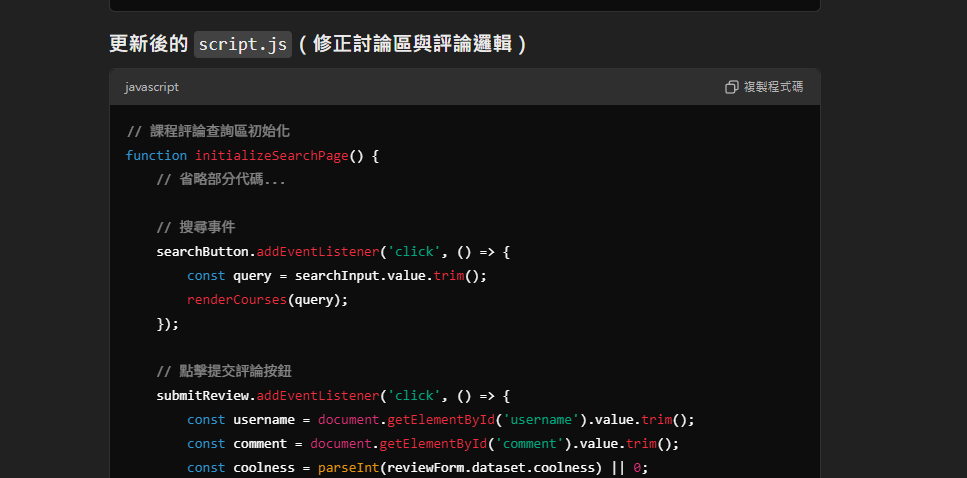
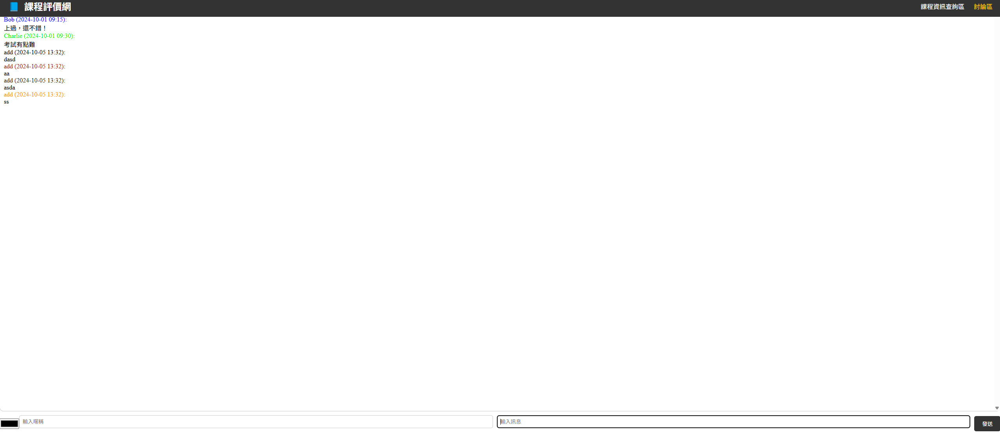
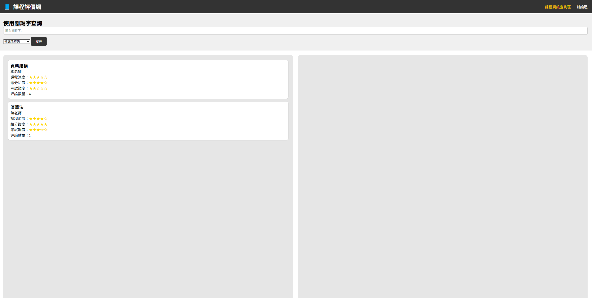
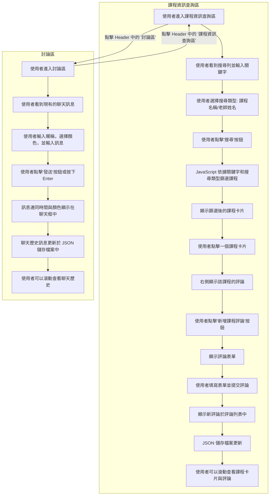

## Prompt1

`RAG_injection.md` + `user_prompts`

## Result1

結果有錯誤

- data.json產生出來的資料太少筆，課程至少要有五筆，課程評論至少要有六筆
- 按下新增課程評論的按鈕後，課程涼度評分、給分甜度評分、考試難度評分的星星圖案點擊後不會填滿
- 按下提交按鈕後星星不會顯示相對應數量的填滿顏色的星星
- 在課程評論查詢區中，頁面會出現scroll bar，會連header一起滾動，我要的效果是整個頁面無法滾動，是左右兩邊的區塊內部可以滾動
- 課程評論的區的課程卡片部分太高了，直接佔滿了整個區域高
- 課程卡片不應該顯示討論熱度，應該是評論數量
- 討論區頁面沒有顯示在data.json中的歷史討論訊息
- 無法送出討論區的訊息



## Prompt2

結果有錯誤

- data.json產生出來的資料太少筆，課程至少要有五筆，課程評論至少要有六筆
- 按下新增課程評論的按鈕後，課程涼度評分、給分甜度評分、考試難度評分的星星圖案點擊後不會填滿
- 按下提交按鈕後星星不會顯示相對應數量的填滿顏色的星星
- 在課程評論查詢區中，頁面會出現scroll bar，會連header一起滾動，我要的效果是整個頁面無法滾動，是左右兩邊的區塊內部可以滾動
- 課程評論的區的課程卡片部分太高了，直接佔滿了整個區域高
- 課程卡片不應該顯示討論熱度，應該是評論數量
- 討論區頁面沒有顯示在data.json中的歷史討論訊息
- 無法送出討論區的訊息

修正以以上錯誤並給我完整程式碼 

## Result2

沒有修好任何錯誤，反而連任何的課程card都沒出現了
而且並沒有給我完整程式碼，只給我了data.json 和 script.js



## Prompt3

沒有修好任何錯誤，反而連任何的課程card都沒出現了，修正後給我好的完整程式碼

## Result3

修好了
- 按下新增課程評論的按鈕後，課程涼度評分、給分甜度評分、考試難度評分的星星圖案點擊後不會填滿
- data.json產生出來的資料太少筆，課程至少要有五筆，課程評論至少要有六筆
- 按下提交按鈕後星星不會顯示相對應數量的填滿顏色的星星
- 在課程評論查詢區中，頁面會出現scroll bar，會連header一起滾動，我要的效果是整個頁面無法滾動，是左右兩邊的區塊內部可以滾動
- 課程評論的區的課程卡片部分太高了，直接佔滿了整個區域高
- 課程卡片不應該顯示討論熱度，應該是評論數量

還是有的錯誤

- 討論區頁面沒有顯示在data.json中的歷史討論訊息
- 無法送出討論區的訊息

新錯誤

- 在課程評論查詢區中，左右兩邊的區塊沒有平分空間，右邊區塊右邊會有一大塊空白
- 左右兩側的區塊底部沒有顯示出一個padding，看起來是被切掉了




## Prompt4

還是有的錯誤

- 討論區頁面沒有顯示在data.json中的歷史討論訊息
- 無法送出討論區的訊息

新錯誤

- 在課程評論查詢區中，左右兩邊的區塊沒有平分空間，右邊區塊右邊會有一大塊空白
- 左右兩側的區塊底部沒有顯示出一個padding，看起來是被切掉了

修正以以上錯誤並給我完整程式碼

## Result4

遇到一個問題，他給的javascript不是全部的檔案，會省略掉重複的部分，導致還是需要看程式碼去修改



修掉的錯誤:

- 討論區頁面沒有顯示在data.json中的歷史討論訊息
- 無法送出討論區的訊息
- 在課程評論查詢區中，左右兩邊的區塊沒有平分空間，右邊區塊右邊會有一大塊空白

基本上使用者需求都有達成，但就是一些Prompts沒有仔細說明的css排版部分不美觀，但這部分不算是錯誤





# 產生mermaid的prompts

## Prompt1

根據以下的使用者需求和符合此需求所產生的程式碼產生出程式碼對應需求的mermaid 描述語言:
+ `user_prompts` + `index.html` + `discussion.html` + `script.js` + `style.css`

## Result1

```mermaid
graph TD
    subgraph Course Information Search
        A1[User visits "課程資訊查詢區"]
        A2[User sees search bar and inputs keyword]
        A3[User selects search type: Course Name/Teacher Name]
        A4[User clicks "Search" button]
        A5[JavaScript filters courses by keyword and search type]
        A6[Filtered course cards are displayed]
        A7[User clicks a course card]
        A8[Course reviews are shown on the right panel]
        A9[User clicks "Add Review" button]
        A10[Review form appears]
        A11[User fills out and submits review]
        A12[New review is displayed in the review list]
        A13[Course reviews updated in JSON storage]
        A14[User can scroll through course cards and reviews]
        A1 --> A2 --> A3 --> A4 --> A5 --> A6 --> A7 --> A8 --> A9 --> A10 --> A11 --> A12 --> A13 --> A14
    end
    
    subgraph Discussion Area
        B1[User visits "討論區"]
        B2[User sees existing messages in the chatbox]
        B3[User enters nickname, selects color, and types a message]
        B4[User clicks "Send" button or presses Enter]
        B5[Message is added to the chatbox with timestamp and color]
        B6[Chat history is stored and updated in JSON storage]
        B7[User can scroll through chat history]
        B1 --> B2 --> B3 --> B4 --> B5 --> B6 --> B7
    end

    A1 -->|Click "討論區" in header| B1
    B1 -->|Click "課程資訊查詢區" in header| A1
```

無法顯示結果，語法錯誤

## Prompt2

產生的Mermaid無法顯示出來，有語法錯誤，重新產生

## Result2



結果正確
