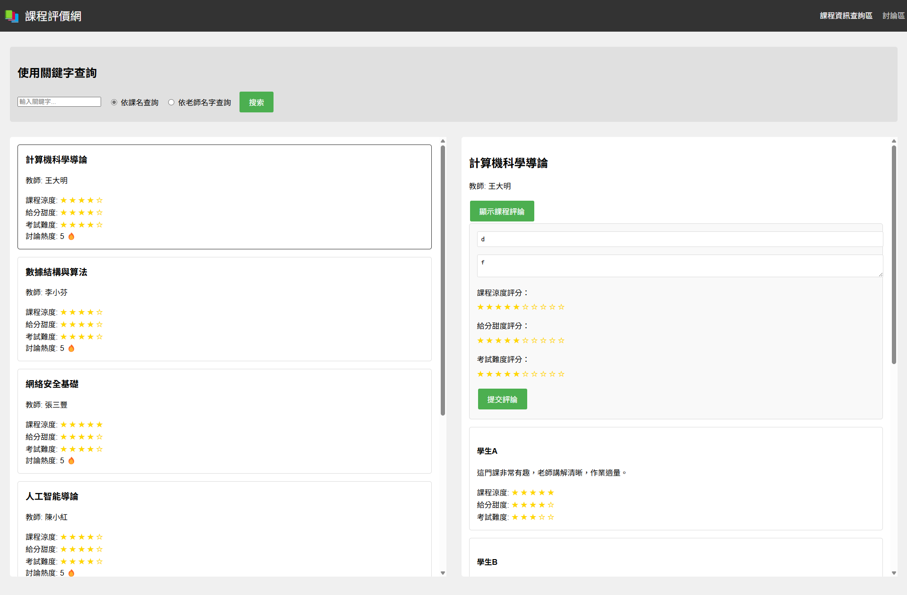

## Prompt1

`RAG_injection.md` + `user_prompts`

## Result1

有一個問題，Claude會有輸出的長度限制，所以會需要在他被限制時繼續Prompt:"繼續產生" 
結果有錯誤

- header 課程評價網左側沒有一個icon圖案，可以用emoji代替
- 在課程評價查詢區的新增課程評論功能中，課程涼度評分、給分甜度評分、考試難度評分的星星圖案點擊後不會填滿
- 在課程評價查詢區的新增課程評論功能中，按下提交按鈕後星星不會顯示相對應數量的填滿顏色的星星

## Prompt2

結果有錯誤

- header 課程評價網左側沒有一個icon圖案，可以用emoji代替
- 在課程評價查詢區的新增課程評論功能中，課程涼度評分、給分甜度評分、考試難度評分的星星圖案點擊後不會填滿
- 在課程評價查詢區的新增課程評論功能中，按下提交按鈕後星星不會顯示相對應數量的填滿顏色的星星

給我修改好的完整程式碼

## Result2

結果有錯誤

- 雖然修改了課程資訊查詢區域header 課程評價網左側沒有一個icon圖案的問題，但是討論區還沒有解決
- 在課程評價card顯示資訊中的討論熱度應該要是評論的數量
- 在課程評價查詢區的新增課程評論功能中，課程涼度評分、給分甜度評分、考試難度評分的星星圖案點擊後不會填滿
- 在課程評價查詢區的新增課程評論功能中，課程涼度評分、給分甜度評分、考試難度評分的星星顯示數量不正確
- 在課程評價查詢區的新增課程評論功能中，按下提交按鈕後星星不會顯示相對應數量的填滿顏色的星星

## Prompt3

結果有錯誤

- 雖然修改了課程資訊查詢區域header 課程評價網左側沒有一個icon圖案的問題，但是討論區還沒有解決
- 在課程評價card顯示資訊中的討論熱度應該要是評論的數量
- 在課程評價查詢區的新增課程評論功能中，課程涼度評分、給分甜度評分、考試難度評分的星星圖案點擊後不會填滿
- 在課程評價查詢區的新增課程評論功能中，課程涼度評分、給分甜度評分、考試難度評分的星星顯示數量不正確
- 在課程評價查詢區的新增課程評論功能中，按下提交按鈕後星星不會顯示相對應數量的填滿顏色的星星

給我修改好的完整程式碼

## Result3

修好了
- 雖然修改了課程資訊查詢區域header 課程評價網左側沒有一個icon圖案的問題，但是討論區還沒有解決
- 在課程評價card顯示資訊中的討論熱度應該要是評論的數量
- 在課程評價查詢區的新增課程評論功能中，課程涼度評分、給分甜度評分、考試難度評分的星星顯示數量不正確
- 在課程評價查詢區的新增課程評論功能中，按下提交按鈕後星星不會顯示相對應數量的填滿顏色的星星

還是有錯誤

- 在課程評價查詢區的新增課程評論功能中，課程涼度評分、給分甜度評分、考試難度評分的星星圖案點擊後不會填滿

## Prompt4

還是有錯誤

- 在課程評價查詢區的新增課程評論功能中，課程涼度評分、給分甜度評分、考試難度評分的星星圖案點擊後不會填滿

給我修改好的完整程式碼

## Result4

還是有錯誤

- 雖然星星可以點擊了，但是顯示的方式變成了一個長條而不是星星，我要的是顯示點擊後會填滿對應數量的星星

新發現錯誤

- 在提交評論的同時，不會同時更新左邊的評論平均分數和評論數量

## Prompt5

還是有錯誤

- 雖然星星可以點擊了，但是顯示的方式變成了一個長條而不是星星，我要的是顯示點擊後會填滿對應數量的星星

新發現錯誤

- 在提交評論的同時，不會同時更新左邊的評論平均分數和評論數量

給我修改好的完整程式碼

## Result5

還是一樣沒改善
但解決了從星星變成長條的問題

## Prompt6

還是有錯誤

- 在提交評論的同時，不會同時更新左邊的評論平均分數和評論數量
- 點擊星星後，星星不會填滿對應數量的星星
- 提交後的評論星星也不會填滿對應數量的星星

給我修改好的完整程式碼

## Result6

改善了以下問題
- 在提交評論的同時，不會同時更新左邊的評論平均分數和評論數量
但以下問題還是沒解決
- 點擊星星後，星星不會填滿對應數量的星星
- 提交後的評論星星也不會填滿對應數量的星星

## Prompt7

改善了以下問題
- 在提交評論的同時，不會同時更新左邊的評論平均分數和評論數量
但以下問題還是沒解決
- 點擊星星後，星星不會填滿對應數量的星星
- 提交後的評論星星也不會填滿對應數量的星星

我再更詳細的說明一下
在新增課程評論功能中，當我點擊星星時，星星不會填滿對應數量的星星，而且提交後的評論星星也不會填滿對應數量的星星
舉例來說，當我點擊課程涼度評分的星星時，當我點擊第三顆星星時，應該要填滿第一到三顆星星，但是現在不會填滿任何星星

給我修改好的完整程式碼

## Result7

結果還是跟上一個一樣，沒有改善

## Prompt8

還是一樣沒有改到

## Result8

還是一樣沒有改到😢，開始鬼打牆

# 產生mermaid的prompts

## Prompt1

根據以下的使用者需求和符合此需求所產生的程式碼產生出程式碼對應需求的mermaid 描述語言:
+ `user_prompts` + `index.html` + `discussion.html` + `script.js` + `style.css`

## Result1

