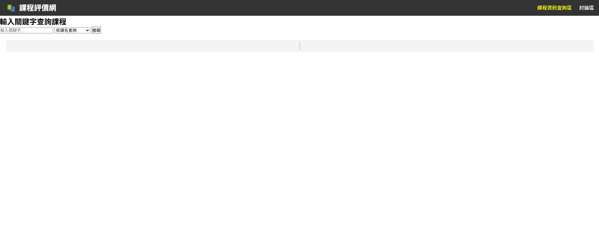
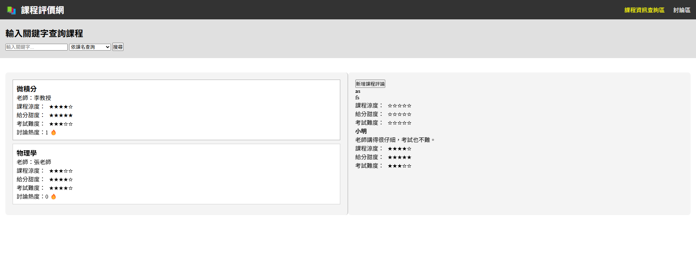
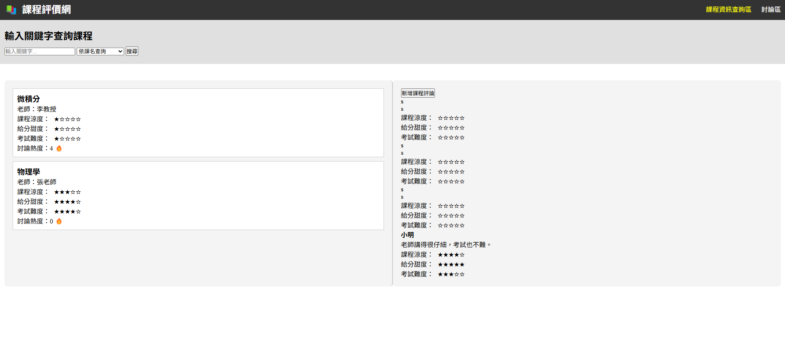
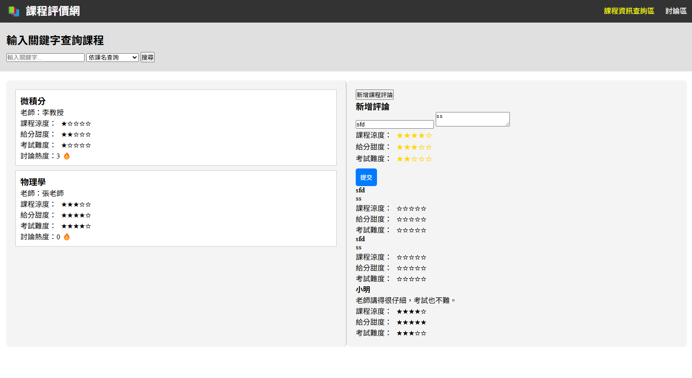
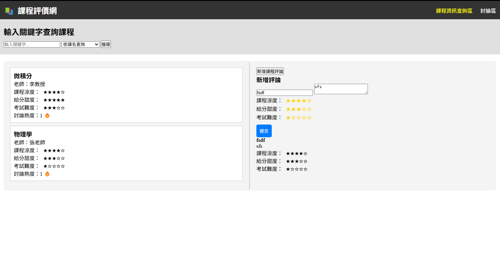

# 產生gherkin

對以下使用者需求轉成用gherkin語法寫成的feature file: + `user_prompts`

## Result1

```gherkin
Feature: Course Review Website

  Scenario: Navigating between Course Info Search Area and Discussion Area
    Given I am on any page
    When I click on "課程資訊查詢區" or "討論區" in the header
    Then I should be redirected to the corresponding page

  Scenario: Displaying Header on Course Info Search Area
    Given I am on the "課程資訊查詢區" page
    Then I should see a header with a dark grey background
    And the header should contain an icon and the text "課程評價網" on the left
    And on the right, there should be two clickable options: "課程資訊查詢區" and "討論區"

  Scenario: Search Filters in Course Info Search Area
    Given I am on the "課程資訊查詢區" page
    Then I should see a light grey background below the header
    And I should see a search input field at the top
    And I should be able to select between "依課名查詢" or "依老師名字查詢"
    When I type in a keyword
    Then I should see filtered course information based on the keyword and selected search option

  Scenario: Displaying Course Information Cards
    Given I am on the "課程資訊查詢區" page
    When I perform a search
    Then the left side should display course information cards
    And each card should display the course name, teacher's name, course rating, and discussion heat
    And the course rating should have three categories: "課程涼度", "給分甜度", and "考試難度" with star icons representing average ratings rounded to the nearest whole number
    And the right side of each card should display the discussion heat count with an icon

  Scenario: Selecting a Course Card and Viewing Reviews
    Given I have performed a search
    When I click on a course card
    Then the selected card should have a dark grey border to highlight it
    And I should see a button labeled "新增課程評論" on the right side
    And the button should display a form for adding a course review when clicked
    And below the button, I should see existing user reviews for the selected course
    And each review card should display the user's name, review content, and ratings for "課程涼度", "給分甜度", and "考試難度" with star icons

  Scenario: Submitting a New Course Review
    Given I have clicked on "新增課程評論" for a course
    When I fill in the form with my name, review content, and ratings
    And I submit the review
    Then the new review should be added to the top of the review list
    And the form should switch back to the "顯示課程評論" mode

  Scenario: Displaying Header on Discussion Area
    Given I am on the "討論區" page
    Then I should see a header with the same dark grey background as "課程資訊查詢區"
    And the active page in the header should be highlighted while the inactive page is dimmed

  Scenario: Chat Room in Discussion Area
    Given I am on the "討論區" page
    Then I should see a chat area with a light grey background
    And below the chat area, I should see input fields for selecting color, nickname, and message content
    And I should be able to enter a message and send it by clicking a button or pressing Enter
    And each message should display the timestamp, nickname with selected color, and message content
    And the chat history should update with each new message

  Scenario: Initial Fake Data for Course Info Search Area
    Given I visit the "課程資訊查詢區" page
    Then I should see at least 6 course cards with pre-generated fake data
    And each course should have at least 5 reviews generated from fake data
    And all the data should be stored in a JSON file

  Scenario: Initial Fake Data for Discussion Area
    Given I visit the "討論區" page
    Then I should see at least 3 different users and 10 initial chat messages generated from fake data
    And all the data should be stored in a JSON file
```

# 產生code

## Prompt1

`RAG_injection.md` + `gherkin.md`

## Result1

有錯誤

- 搜尋欄下方不是淺灰底
- 預設沒有顯示所有課程資訊，要按下搜尋才會顯示
- 點擊左側的課程資訊card物件後，右側沒有顯示任何資訊
- 點擊做測的課程資訊card物件後，不會有深色外框框住
- 討論熱度應該是評論數量
- 討論區的內容沒有送出後儲存在local storage，重整後會消失



## Prompt2

有錯誤

- 搜尋欄下方不是淺灰底
- 預設沒有顯示所有課程資訊，要按下搜尋才會顯示
- 點擊左側的課程資訊card物件後，右側沒有顯示任何資訊
- 點擊做測的課程資訊card物件後，不會有深色外框框住
- 討論熱度應該是評論數量
- 討論區的內容沒有送出後儲存在local storage，重整後會消失

修正以以上錯誤並給我完整程式碼

## Result2

已修正以下錯誤:
- 搜尋欄下方不是淺灰底
- 預設沒有顯示所有課程資訊，要按下搜尋才會顯示
- 點擊左側的課程資訊card物件後，右側沒有顯示任何資訊
- 點擊做測的課程資訊card物件後，不會有深色外框框住
- 討論熱度應該是評論數量

還是有的錯誤:

- 討論區的內容沒有送出後儲存在local storage，重整後會消失
- 在課程資訊查詢區的新增課程評論功能中，課程涼度評分、給分甜度評分、考試難度評分的星星圖案點擊後不會填滿對應數量的星星
- 在課程資訊查詢區的新增課程評論功能中，按下提交按鈕後的評論card中的星星不會顯示相對應數量的填滿顏色的星星，都是空心的星星
- 在課程資訊查詢區的新增課程評論功能中，提交評論後不會同時更新課程資訊card的平均星數和評論數量



## Prompt3

已修正以下錯誤:
- 搜尋欄下方不是淺灰底
- 預設沒有顯示所有課程資訊，要按下搜尋才會顯示
- 點擊左側的課程資訊card物件後，右側沒有顯示任何資訊
- 點擊做測的課程資訊card物件後，不會有深色外框框住
- 討論熱度應該是評論數量

還是有的錯誤:

- 討論區的內容沒有送出後儲存在local storage，重整後會消失
- 在課程資訊查詢區的新增課程評論功能中，課程涼度評分、給分甜度評分、考試難度評分的星星圖案點擊後不會填滿對應數量的星星
- 在課程資訊查詢區的新增課程評論功能中，按下提交按鈕後的評論card中的星星不會顯示相對應數量的填滿顏色的星星，都是空心的星星
- 在課程資訊查詢區的新增課程評論功能中，提交評論後不會同時更新課程資訊card的平均星數和評論數量

修正以以上錯誤並給我完整程式碼

## Result3

已修正以下錯誤:
- 在課程資訊查詢區的新增課程評論功能中，提交評論後不會同時更新課程資訊card的平均星數和評論數量

出現的錯誤:
- 討論區的內容沒有送出後儲存在local storage，重整後會消失，需要把討論區的訊息儲存到local storage中
- 在課程資訊查詢區的新增課程評論功能中，課程涼度評分、給分甜度評分、考試難度評分的星星圖案點擊後不會填滿對應數量的星星
- 在課程資訊查詢區的新增課程評論功能中，按下提交按鈕後的評論card中的星星不會顯示相對應數量的填滿顏色的星星，都是空心的星星
- 預設沒有顯示所有課程資訊，要按下搜尋才會顯示



## Prompt4

已修正以下錯誤:
- 在課程資訊查詢區的新增課程評論功能中，提交評論後不會同時更新課程資訊card的平均星數和評論數量

出現的錯誤:
- 討論區的內容沒有送出後儲存在local storage，重整後會消失，需要把討論區的訊息儲存到local storage中
- 在課程資訊查詢區的新增課程評論功能中，課程涼度評分、給分甜度評分、考試難度評分的星星圖案點擊後不會填滿對應數量的星星
- 在課程資訊查詢區的新增課程評論功能中，按下提交按鈕後的評論card中的星星不會顯示相對應數量的填滿顏色的星星，都是空心的星星
- 預設沒有顯示所有課程資訊，要按下搜尋才會顯示

修正以以上錯誤並給我完整程式碼

## Result4

已修正以下錯誤:
- 在課程資訊查詢區的新增課程評論功能中，按下提交按鈕後的評論card中的星星不會顯示相對應數量的填滿顏色的星星，都是空心的星星

還是有的錯誤:
- 討論區的內容沒有送出後儲存在local storage，重整後會消失，需要把討論區的訊息儲存到local storage中
- 在課程資訊查詢區的新增課程評論功能中，課程涼度評分、給分甜度評分、考試難度評分的星星圖案點擊後不會更新成填滿對應數量的星星
- 預設沒有顯示所有課程資訊，要按下搜尋才會顯示，需要預設顯示所有課程資訊

## Prompt5

已修正以下錯誤:
- 在課程資訊查詢區的新增課程評論功能中，按下提交按鈕後的評論card中的星星不會顯示相對應數量的填滿顏色的星星，都是空心的星星

還是有的錯誤:
- 討論區的內容沒有送出後儲存在local storage，重整後會消失，需要把討論區的訊息儲存到local storage中
- 在課程資訊查詢區的新增課程評論功能中，課程涼度評分、給分甜度評分、考試難度評分的星星圖案點擊後不會更新成填滿對應數量的星星
- 預設沒有顯示所有課程資訊，要按下搜尋才會顯示，需要預設顯示所有課程資訊

修正以以上錯誤並給我完整程式碼

## Result5

已修正以下錯誤:
- 討論區的內容沒有送出後儲存在local storage，重整後會消失，需要把討論區的訊息儲存到local storage中
- 預設沒有顯示所有課程資訊，要按下搜尋才會顯示，需要預設顯示所有課程資訊

還是有的錯誤:
- 在課程資訊查詢區的新增課程評論功能中，課程涼度評分、給分甜度評分、考試難度評分的星星圖案點擊後不會更新成填滿對應數量的星星

## Prompt6

已修正以下錯誤:
- 討論區的內容沒有送出後儲存在local storage，重整後會消失，需要把討論區的訊息儲存到local storage中
- 預設沒有顯示所有課程資訊，要按下搜尋才會顯示，需要預設顯示所有課程資訊

還是有的錯誤:
- 在課程資訊查詢區的新增課程評論功能中，在新增課程功能下的對於:課程涼度評分、給分甜度評分、考試難度評分的星星icon點擊後不會把到被點擊到的星星變成填滿的星星，需要修正成點擊後會填滿對應數量的星星

修正以以上錯誤並給我完整程式碼

## Result6



## Prompt7

已修正以下錯誤:
- 在課程資訊查詢區的新增課程評論功能中，課程涼度評分、給分甜度評分、考試難度評分的星星圖案點擊後不會更新成填滿對應數量的星星

出現的錯誤:
- 在課程資訊查詢區的新增課程評論功能中，按下提交按鈕後新增的評論card中的星星不會顯示相對應數量的填滿顏色的星星，都是空心的星星，應該要填滿對應數量的星星

修正以以上錯誤並給我完整程式碼

## Result7

還是一樣的錯誤

## Prompt8

還是一樣的錯誤，沒有改善 
我再更詳細的說明:

在課程資訊查詢區的新增課程評論功能中，當我按下新增課程評論的按鈕後，可以對課程涼度評分、給分甜度評分、考試難度評分的星星圖案點擊進行評分，按下提交後，新增的評論card中的星星不會顯示相對應數量的填滿顏色的星星，都是空心的星星，應該要填滿對應數量的星星

修正以以上錯誤並給我完整程式碼

## Result8

完成所有需求



