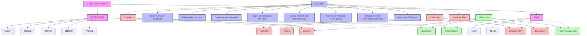

# 產生testing

## Prompt1:

幫我對以下使用者需求做為prompts讓llm產生的的網頁程式碼撰寫Playwright的typescript E2E測試程式碼，預設Endpoint為`http://localhost:8080`:
使用者需求:
`user_prompts.md`
index.html:
`index.html`
discussion.html:
`discussion.html`
script.js:
`script.js`
discussion.js:
`discussion.js`
style.css:
`style.css`
comments.json:
`comments.json`
courses.json:
`courses.json`
initial_message.json:
`initial_message.json`

## Result1

```typescript
import { test, expect } from '@playwright/test';

test.describe('Course Review Website E2E Tests', () => {
  test.beforeEach(async ({ page }) => {
    await page.goto('http://localhost:8080');
  });

  test('Header navigation', async ({ page }) => {
    await expect(page.locator('header')).toBeVisible();
    await expect(page.locator('header .logo')).toContainText('課程評價網');
    
    await page.click('text=討論區');
    await expect(page).toHaveURL('http://localhost:8080/discussion.html');
    
    await page.click('text=課程資訊查詢區');
    await expect(page).toHaveURL('http://localhost:8080/index.html');
  });

  test('Course search functionality', async ({ page }) => {
    await page.fill('#search-input', '程式設計');
    await page.click('#search-button');
    await expect(page.locator('.course-card')).toContainText('程式設計概論');

    await page.click('input[value="teacher"]');
    await page.fill('#search-input', '王小明');
    await page.click('#search-button');
    await expect(page.locator('.course-card')).toContainText('王小明');
  });

  test('Course selection and comment display', async ({ page }) => {
    await page.click('.course-card:first-child');
    await expect(page.locator('.course-card:first-child')).toHaveClass(/selected/);
    await expect(page.locator('#course-details')).toBeVisible();
    await expect(page.locator('#comments-list .comment')).toHaveCount(2);
  });

  test('Add new comment', async ({ page }) => {
    await page.click('.course-card:first-child');
    await page.click('#add-comment-button');
    await page.fill('#username', 'Test User');
    await page.fill('#comment-content', 'This is a test comment');
    await page.click('.stars[data-rating="course-coolness"] span:nth-child(4)');
    await page.click('.stars[data-rating="grading-sweetness"] span:nth-child(3)');
    await page.click('.stars[data-rating="exam-difficulty"] span:nth-child(2)');
    await page.click('#submit-comment');
    
    await expect(page.locator('#comments-list .comment')).toHaveCount(3);
    await expect(page.locator('#comments-list .comment:first-child')).toContainText('Test User');
    await expect(page.locator('#comments-list .comment:first-child')).toContainText('This is a test comment');
  });

  test('Discussion board functionality', async ({ page }) => {
    await page.goto('http://localhost:8080/discussion.html');
    await expect(page.locator('#chat-messages .message')).toHaveCount(10);

    await page.fill('#nickname', 'Test User');
    await page.fill('#message-input', 'Hello, this is a test message!');
    await page.click('#send-message');

    await expect(page.locator('#chat-messages .message')).toHaveCount(11);
    await expect(page.locator('#chat-messages .message:last-child')).toContainText('Test User');
    await expect(page.locator('#chat-messages .message:last-child')).toContainText('Hello, this is a test message!');
  });
});
```

有一些沒有做到詳細的測是，例如
- 新增課程評論的部份，應該要檢查是不是新增的評論card上面的星星被填滿的數量是對的
- 新增評論後左側的的課程資訊card上面的評論數量有沒有增加、被填滿的星數有沒有更新
- 沒有檢查到需求上描述的css style，如header顏色
- 沒有檢查原始資料的json檔案是否有被正確讀取

## Prompt2:

有一些沒有做到詳細的測是，例如
- 新增課程評論的部份，應該要檢查是不是新增的評論card上面的星星被填滿的數量是對的
- 新增評論後左側的的課程資訊card上面的評論數量有沒有增加、被填滿的星數有沒有更新
- 沒有檢查到需求上描述的css style，如header顏色
- 沒有檢查原始資料的json檔案是否有被正確讀取

給我完整正確的測試程式碼

## Result2

```typescript
import { test, expect } from '@playwright/test';
import fs from 'fs';
import path from 'path';

test.describe('Course Review Website E2E Tests', () => {
  test.beforeEach(async ({ page }) => {
    await page.goto('http://localhost:8080');
  });

  test('Header styling and navigation', async ({ page }) => {
    const header = page.locator('header');
    await expect(header).toBeVisible();
    await expect(header).toHaveCSS('background-color', 'rgb(51, 51, 51)'); // 深灰色
    await expect(page.locator('header .logo')).toContainText('課程評價網');
    
    const navLinks = page.locator('nav a');
    await expect(navLinks).toHaveCount(2);
    await expect(navLinks.nth(0)).toHaveClass(/active/);
    
    await page.click('text=討論區');
    await expect(page).toHaveURL('http://localhost:8080/discussion.html');
    await expect(navLinks.nth(1)).toHaveClass(/active/);
    
    await page.click('text=課程資訊查詢區');
    await expect(page).toHaveURL('http://localhost:8080/index.html');
    await expect(navLinks.nth(0)).toHaveClass(/active/);
  });

  test('Page background color', async ({ page }) => {
    await expect(page.locator('body')).toHaveCSS('background-color', 'rgb(240, 240, 240)'); // 淺灰色
  });

  test('Course search functionality', async ({ page }) => {
    await page.fill('#search-input', '程式設計');
    await page.click('#search-button');
    await expect(page.locator('.course-card')).toContainText('程式設計概論');

    await page.click('input[value="teacher"]');
    await page.fill('#search-input', '王小明');
    await page.click('#search-button');
    await expect(page.locator('.course-card')).toContainText('王小明');
  });

  test('Course card styling and information', async ({ page }) => {
    const firstCard = page.locator('.course-card').first();
    await expect(firstCard).toHaveCSS('background-color', 'rgb(255, 255, 255)'); // 白色背景
    await expect(firstCard).toHaveCSS('border-radius', '4px'); // 圓角

    await expect(firstCard.locator('h3')).toBeVisible(); // 課程名稱
    await expect(firstCard.locator('p:has-text("教師：")')).toBeVisible(); // 老師姓名
    await expect(firstCard.locator('.ratings')).toBeVisible(); // 評分區域
    await expect(firstCard.locator('p:has-text("討論熱度：")')).toBeVisible(); // 討論熱度
  });

  test('Course selection and comment display', async ({ page }) => {
    await page.click('.course-card:first-child');
    await expect(page.locator('.course-card:first-child')).toHaveClass(/selected/);
    await expect(page.locator('.course-card:first-child')).toHaveCSS('border-color', 'rgb(51, 51, 51)'); // 深灰色邊框
    await expect(page.locator('#course-details')).toBeVisible();
    await expect(page.locator('#comments-list .comment')).toHaveCount(2);
  });

  test('Add new comment and verify updates', async ({ page }) => {
    await page.click('.course-card:first-child');
    const initialCommentCount = await page.locator('.course-card:first-child p:has-text("討論熱度：")').innerText();
    const initialRatings = await page.locator('.course-card:first-child .ratings').innerText();

    await page.click('#add-comment-button');
    await page.fill('#username', 'Test User');
    await page.fill('#comment-content', 'This is a test comment');
    await page.click('.stars[data-rating="course-coolness"] span:nth-child(4)');
    await page.click('.stars[data-rating="grading-sweetness"] span:nth-child(3)');
    await page.click('.stars[data-rating="exam-difficulty"] span:nth-child(2)');
    await page.click('#submit-comment');
    
    // 檢查新評論
    const newComment = page.locator('#comments-list .comment').first();
    await expect(newComment).toContainText('Test User');
    await expect(newComment).toContainText('This is a test comment');
    await expect(newComment.locator('.stars').nth(0)).toContainText('★★★★☆');
    await expect(newComment.locator('.stars').nth(1)).toContainText('★★★☆☆');
    await expect(newComment.locator('.stars').nth(2)).toContainText('★★☆☆☆');

    // 檢查課程卡片更新
    const updatedCommentCount = await page.locator('.course-card:first-child p:has-text("討論熱度：")').innerText();
    expect(parseInt(updatedCommentCount.split(' ')[1])).toBeGreaterThan(parseInt(initialCommentCount.split(' ')[1]));

    const updatedRatings = await page.locator('.course-card:first-child .ratings').innerText();
    expect(updatedRatings).not.toBe(initialRatings);
  });

  test('Discussion board functionality and styling', async ({ page }) => {
    await page.goto('http://localhost:8080/discussion.html');
    
    const chatContainer = page.locator('.chat-container');
    await expect(chatContainer).toHaveCSS('background-color', 'rgb(255, 255, 255)'); // 白色背景
    await expect(chatContainer).toHaveCSS('border', '1px solid rgb(221, 221, 221)'); // 邊框

    await expect(page.locator('#chat-messages .message')).toHaveCount(10);

    await page.fill('#nickname', 'Test User');
    await page.fill('#message-input', 'Hello, this is a test message!');
    await page.click('#send-message');

    await expect(page.locator('#chat-messages .message')).toHaveCount(11);
    const lastMessage = page.locator('#chat-messages .message').last();
    await expect(lastMessage).toContainText('Test User');
    await expect(lastMessage).toContainText('Hello, this is a test message!');
  });

  test('Verify initial JSON data', async ({ page }) => {
    // 讀取並解析 JSON 文件
    const coursesData = JSON.parse(fs.readFileSync(path.join(__dirname, '../courses.json'), 'utf-8'));
    const commentsData = JSON.parse(fs.readFileSync(path.join(__dirname, '../comments.json'), 'utf-8'));
    const initialMessagesData = JSON.parse(fs.readFileSync(path.join(__dirname, '../initial_messages.json'), 'utf-8'));

    // 驗證課程數據
    const courseCards = await page.locator('.course-card').count();
    expect(courseCards).toBe(coursesData.length);

    for (let i = 0; i < courseCards; i++) {
      const card = page.locator('.course-card').nth(i);
      await expect(card).toContainText(coursesData[i].name);
      await expect(card).toContainText(coursesData[i].teacher);
      await expect(card).toContainText(`討論熱度：${coursesData[i].commentCount}`);
    }

    // 驗證評論數據
    await page.click('.course-card:first-child');
    const comments = await page.locator('#comments-list .comment').count();
    const courseComments = commentsData.filter(comment => comment.courseId === 1);
    expect(comments).toBe(courseComments.length);

    // 驗證初始聊天消息
    await page.goto('http://localhost:8080/discussion.html');
    const messages = await page.locator('#chat-messages .message').count();
    expect(messages).toBe(initialMessagesData.length);
  });
});
```

在'Add new comment and verify updates'中的檢查課程卡片更新會出現錯誤:

claude.spec.ts:86
Error: expect(received).toBeGreaterThan(expected)

Expected: > NaN
Received:   NaN

initialCommentCount的值是NaN，導致測試結果錯誤，應該是元素選擇方法的錯誤


## Prompt3

在'Add new comment and verify updates'中的檢查課程卡片更新會出現錯誤:

claude.spec.ts:86
Error: expect(received).toBeGreaterThan(expected)

Expected: > NaN
Received:   NaN

initialCommentCount的值是NaN，導致測試結果錯誤，應該是元素選擇方法的錯誤

給我完整正確的測試程式碼

## Result3

```typescript
import { test, expect } from '@playwright/test';
import fs from 'fs';
import path from 'path';

test.describe('Course Review Website E2E Tests', () => {
  test.beforeEach(async ({ page }) => {
    await page.goto('http://localhost:8080');
  });

  test('Header styling and navigation', async ({ page }) => {
    const header = page.locator('header');
    await expect(header).toBeVisible();
    await expect(header).toHaveCSS('background-color', 'rgb(51, 51, 51)'); // 深灰色
    await expect(page.locator('header .logo')).toContainText('課程評價網');
    
    const navLinks = page.locator('nav a');
    await expect(navLinks).toHaveCount(2);
    await expect(navLinks.nth(0)).toHaveClass(/active/);
    
    await page.click('text=討論區');
    await expect(page).toHaveURL('http://localhost:8080/discussion.html');
    await expect(navLinks.nth(1)).toHaveClass(/active/);
    
    await page.click('text=課程資訊查詢區');
    await expect(page).toHaveURL('http://localhost:8080/index.html');
    await expect(navLinks.nth(0)).toHaveClass(/active/);
  });

  test('Page background color', async ({ page }) => {
    await expect(page.locator('body')).toHaveCSS('background-color', 'rgb(240, 240, 240)'); // 淺灰色
  });

  test('Course search functionality', async ({ page }) => {
    await page.fill('#search-input', '程式設計');
    await page.click('#search-button');
    await expect(page.locator('.course-card')).toContainText('程式設計概論');

    await page.click('input[value="teacher"]');
    await page.fill('#search-input', '王小明');
    await page.click('#search-button');
    await expect(page.locator('.course-card')).toContainText('王小明');
  });

  test('Course card styling and information', async ({ page }) => {
    const firstCard = page.locator('.course-card').first();
    await expect(firstCard).toHaveCSS('background-color', 'rgb(255, 255, 255)'); // 白色背景
    await expect(firstCard).toHaveCSS('border-radius', '4px'); // 圓角

    await expect(firstCard.locator('h3')).toBeVisible(); // 課程名稱
    await expect(firstCard.locator('p:has-text("教師：")')).toBeVisible(); // 老師姓名
    await expect(firstCard.locator('.ratings')).toBeVisible(); // 評分區域
    await expect(firstCard.locator('p:has-text("討論熱度：")')).toBeVisible(); // 討論熱度
  });

  test('Course selection and comment display', async ({ page }) => {
    await page.click('.course-card:first-child');
    await expect(page.locator('.course-card:first-child')).toHaveClass(/selected/);
    await expect(page.locator('.course-card:first-child')).toHaveCSS('border-color', 'rgb(51, 51, 51)'); // 深灰色邊框
    await expect(page.locator('#course-details')).toBeVisible();
    await expect(page.locator('#comments-list .comment')).toHaveCount(2);
  });

  test('Add new comment and verify updates', async ({ page }) => {
    await page.click('.course-card:first-child');
    const initialCommentCountText = await page.locator('.course-card:first-child p:has-text("討論熱度：")').innerText();
    const initialCommentCount = parseInt(initialCommentCountText.split('：')[1].trim());
    const initialRatings = await page.locator('.course-card:first-child .ratings').innerText();

    await page.click('#add-comment-button');
    await page.fill('#username', 'Test User');
    await page.fill('#comment-content', 'This is a test comment');
    await page.click('.stars[data-rating="course-coolness"] span:nth-child(4)');
    await page.click('.stars[data-rating="grading-sweetness"] span:nth-child(3)');
    await page.click('.stars[data-rating="exam-difficulty"] span:nth-child(2)');
    await page.click('#submit-comment');
    
    // 檢查新評論
    const newComment = page.locator('#comments-list .comment').first();
    await expect(newComment).toContainText('Test User');
    await expect(newComment).toContainText('This is a test comment');
    await expect(newComment.locator('.stars').nth(0)).toContainText('★★★★☆');
    await expect(newComment.locator('.stars').nth(1)).toContainText('★★★☆☆');
    await expect(newComment.locator('.stars').nth(2)).toContainText('★★☆☆☆');

    // 檢查課程卡片更新
    const updatedCommentCountText = await page.locator('.course-card:first-child p:has-text("討論熱度：")').innerText();
    const updatedCommentCount = parseInt(updatedCommentCountText.split('：')[1].trim());
    expect(updatedCommentCount).toBeGreaterThan(initialCommentCount);

    const updatedRatings = await page.locator('.course-card:first-child .ratings').innerText();
    expect(updatedRatings).not.toBe(initialRatings);
  });

  test('Discussion board functionality and styling', async ({ page }) => {
    await page.goto('http://localhost:8080/discussion.html');
    
    const chatContainer = page.locator('.chat-container');
    await expect(chatContainer).toHaveCSS('background-color', 'rgb(255, 255, 255)'); // 白色背景
    await expect(chatContainer).toHaveCSS('border', '1px solid rgb(221, 221, 221)'); // 邊框

    await expect(page.locator('#chat-messages .message')).toHaveCount(10);

    await page.fill('#nickname', 'Test User');
    await page.fill('#message-input', 'Hello, this is a test message!');
    await page.click('#send-message');

    await expect(page.locator('#chat-messages .message')).toHaveCount(11);
    const lastMessage = page.locator('#chat-messages .message').last();
    await expect(lastMessage).toContainText('Test User');
    await expect(lastMessage).toContainText('Hello, this is a test message!');
  });

  test('Verify initial JSON data', async ({ page }) => {
    // 讀取並解析 JSON 文件
    const coursesData = JSON.parse(fs.readFileSync(path.join(__dirname, '../courses.json'), 'utf-8'));
    const commentsData = JSON.parse(fs.readFileSync(path.join(__dirname, '../comments.json'), 'utf-8'));
    const initialMessagesData = JSON.parse(fs.readFileSync(path.join(__dirname, '../initial_messages.json'), 'utf-8'));

    // 驗證課程數據
    const courseCards = await page.locator('.course-card').count();
    expect(courseCards).toBe(coursesData.length);

    for (let i = 0; i < courseCards; i++) {
      const card = page.locator('.course-card').nth(i);
      await expect(card).toContainText(coursesData[i].name);
      await expect(card).toContainText(coursesData[i].teacher);
      await expect(card).toContainText(`討論熱度：${coursesData[i].commentCount}`);
    }

    // 驗證評論數據
    await page.click('.course-card:first-child');
    const comments = await page.locator('#comments-list .comment').count();
    const courseComments = commentsData.filter(comment => comment.courseId === 1);
    expect(comments).toBe(courseComments.length);

    // 驗證初始聊天消息
    await page.goto('http://localhost:8080/discussion.html');
    const messages = await page.locator('#chat-messages .message').count();
    expect(messages).toBe(initialMessagesData.length);
  });
});
```

還是有錯誤，
- 提交新的評論後的課程資訊card的星星是會經過四捨五入而變化，所以不應該是測試
expect(updatedRatings).not.toBe(initialRatings);
而是要根據測時所按星星數的去比較是不是要一樣，或大於或小於

## Prompt4

還是有錯誤，
- 提交新的評論後的課程資訊card的星星是會經過四捨五入而變化，所以不應該是測試
expect(updatedRatings).not.toBe(initialRatings);
而是要根據測時所按星星數的去比較是不是要一樣，或大於或小於

給我完整正確的測試程式碼

## Result4 

Done

# 生mermaid

依照此份測試的結構對應使用者需求和程式碼生成出mermaid語法寫成的架構圖出來

