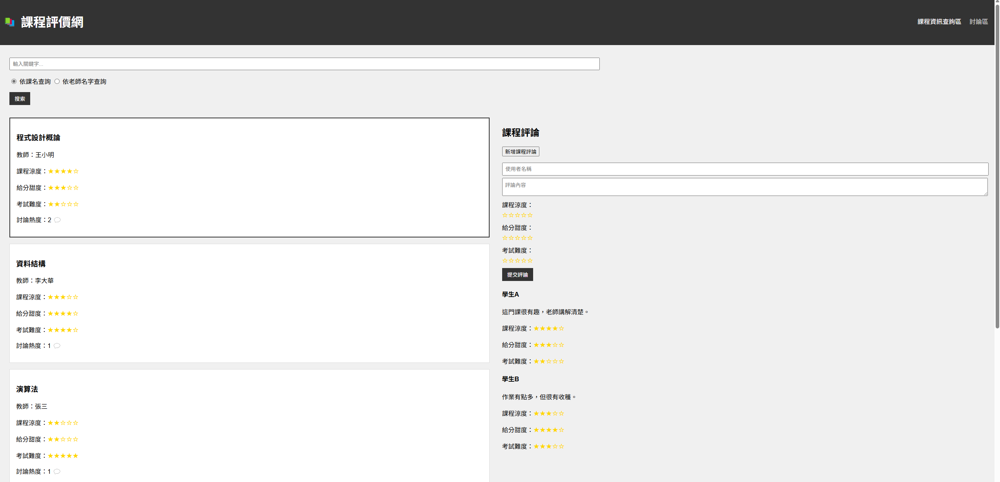
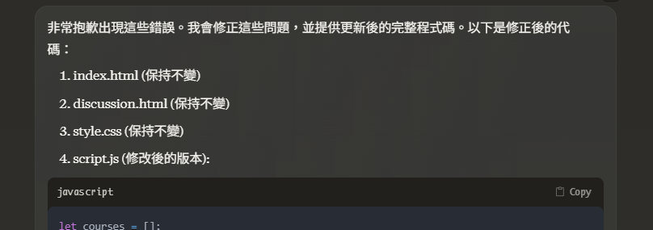
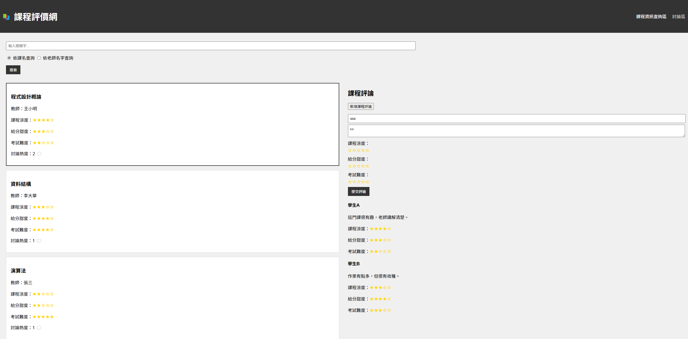
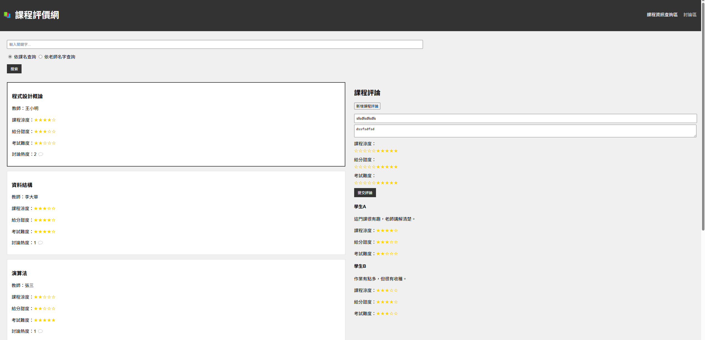
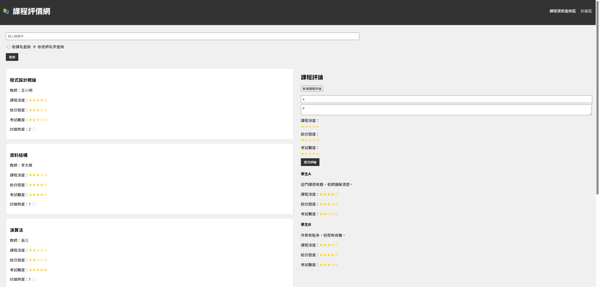
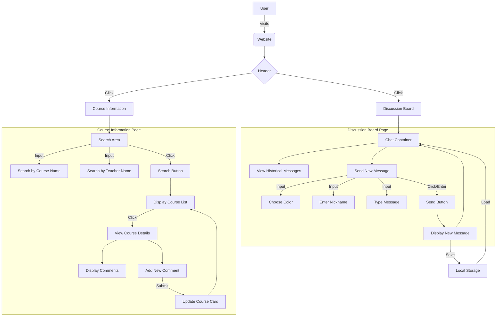

# 產生gherkin

## Prompt1
對以下使用者需求轉成用gherkin語法寫成的feature file: + `user_prompts`

## Result1

```gherkin
Feature: 課程資訊查詢區
  作為一個使用者
  我想要能夠查詢和評論課程
  以便我可以做出明智的選課決定

  Background:
    Given 網站有一個深灰色的 header
    And header 右側有「課程資訊查詢區」和「討論區」兩個選項
    And header 左側有一個 icon 圖案和「課程評價網」的字樣

  Scenario: 切換頁面
    When 我點擊 header 中的「討論區」選項
    Then 頁面應該跳轉到討論區

  Scenario: 搜索課程
    Given 我在課程資訊查詢區頁面
    And 頁面上方有一個輸入框
    And 輸入框右上方有「依課名查詢」和「依老師名字查詢」的選項
    When 我在輸入框中輸入關鍵字
    And 選擇查詢方式
    And 點擊搜索按鈕
    Then 系統應該顯示符合條件的課程列表

  Scenario: 查看課程資訊
    Given 頁面左側顯示課程列表
    And 每個課程以 card 形式呈現
    And card 包含課程名稱、老師姓名、評分和討論熱度
    When 我點擊一個課程 card
    Then 該 card 應該有深灰色外框
    And 頁面右側應該顯示該課程的詳細評論

  Scenario: 新增課程評論
    Given 我已選擇一個課程
    When 我點擊「新增課程評論」按鈕
    Then 系統應該顯示評論輸入區域
    And 輸入區域應該包含使用者名稱、評論內容和評分選項
    When 我填寫評論並提交
    Then 新評論應該出現在課程評論列表的最上方

Feature: 討論區
  作為一個使用者
  我想要能夠參與討論
  以便與其他使用者交流意見

  Background:
    Given 網站有一個深灰色的 header
    And 當前頁面的選項文字應該變亮

  Scenario: 發送訊息
    Given 討論區有一個大型聊天框
    And 聊天框下方有顏色、暱稱和訊息輸入區
    When 我選擇顏色和輸入暱稱
    And 在訊息輸入區輸入內容
    And 點擊發送按鈕或按下 Enter 鍵
    Then 我的訊息應該出現在聊天框中
    And 訊息應該包含發送時間、暱稱、顏色和內容

  Scenario: 查看歷史訊息
    Given 討論區已有一些初始的歷史訊息
    When 我進入討論區
    Then 我應該能看到至少 10 條來自 3 個不同使用者的訊息
```

有錯誤，沒有詳細的描述課程以card形式呈現的內容，評分要包刮課程涼度、給分甜度、考試難度，且要以五顆星星作為呈現，討論熱度應該是評論數量

## Prompt2

有錯誤，沒有詳細的描述課程以card形式呈現的內容，評分要包刮課程涼度、給分甜度、考試難度，且要以五顆星星作為呈現，討論熱度應該是評論數量
重新生成gherkin語法的feature file給我，需要把所有的需求都包含進去

## Result2

```gherkin
Feature: 課程資訊查詢區
作為一個使用者
我想要能夠查詢和評論課程
以便我可以做出明智的選課決定
Background:
Given 網站有一個深灰色的 header
And header 右側有「課程資訊查詢區」和「討論區」兩個選項
And header 左側有一個 icon 圖案和「課程評價網」的字樣
Scenario: 切換頁面
When 我點擊 header 中的「討論區」選項
Then 頁面應該跳轉到討論區
Scenario: 搜索課程
Given 我在課程資訊查詢區頁面
And 頁面上方有一個輸入框
And 輸入框右上方有「依課名查詢」和「依老師名字查詢」的選項
When 我在輸入框中輸入關鍵字
And 選擇查詢方式
And 點擊搜索按鈕
Then 系統應該顯示符合條件的課程列表
Scenario: 查看課程列表
Given 頁面左側顯示課程列表
And 每個課程以 card 形式呈現
And 每個 card 包含以下信息：
| 位置     | 內容             |
| 左上角   | 課程名稱         |
| 右上角   | 老師姓名         |
| 左下角   | 三列評分         |
| 右下角   | 討論熱度         |
And 評分包括以下三項：
| 評分項目   | 呈現方式       |
| 課程涼度   | 五顆星星       |
| 給分甜度   | 五顆星星       |
| 考試難度   | 五顆星星       |
And 討論熱度顯示為評論數量和圖標
Scenario: 查看課程詳細資訊
When 我點擊一個課程 card
Then 該 card 應該有深灰色外框
And 頁面右側應該顯示該課程的詳細評論列表
Scenario: 新增課程評論
Given 我已選擇一個課程
When 我點擊「新增課程評論」按鈕
Then 系統應該顯示評論輸入區域
And 輸入區域應該包含以下欄位：
| 欄位         | 類型           |
| 使用者名稱   | 文本輸入框     |
| 評論內容     | 多行文本框     |
| 課程涼度     | 五顆星星選擇   |
| 給分甜度     | 五顆星星選擇   |
| 考試難度     | 五顆星星選擇   |
When 我填寫評論並提交
Then 新評論應該出現在課程評論列表的最上方
And 課程 card 的評分和討論熱度應該更新
Feature: 討論區
作為一個使用者
我想要能夠參與討論
以便與其他使用者交流意見
Background:
Given 網站有一個深灰色的 header
And 當前頁面的選項文字應該變亮
Scenario: 發送訊息
Given 討論區有一個大型聊天框
And 聊天框下方有以下輸入區：
| 輸入項   | 描述           |
| 顏色選擇 | 用於訊息顏色   |
| 暱稱     | 文本輸入框     |
| 訊息     | 文本輸入框     |
When 我選擇顏色和輸入暱稱
And 在訊息輸入區輸入內容
And 點擊發送按鈕或按下 Enter 鍵
Then 我的訊息應該出現在聊天框中
And 訊息應該包含以下信息：
| 信息項   | 描述           |
| 發送時間 | 當前時間       |
| 暱稱     | 我輸入的暱稱   |
| 顏色     | 我選擇的顏色   |
| 內容     | 我輸入的訊息   |
Scenario: 查看歷史訊息
Given 討論區已有一些初始的歷史訊息
When 我進入討論區
Then 我應該能看到至少 10 條來自 3 個不同使用者的訊息
And 這些訊息應該按時間順序排列，最新的在最下方
Scenario: 歷史訊息的持久化
Given 我已經發送了一些訊息
When 我重新載入頁面
Then 我之前發送的訊息應該仍然可見
And 所有訊息應該保持原有的順序和格式
```

# 產生code

## Prompt1

`RAG_injection.md` + `gherkin.md`

## Result1



有以下錯誤:
- 在課程評論資訊查詢區中，點擊左側課程資訊card後，右側的新增課程評論在對於課程涼度、給分甜度、考試難度的星星圖案點擊後不會變成填滿的星星，照理說應該要填滿到點擊的位置
- 在課程評論資訊查詢區中的新增評論功能，按下提交評論按鈕後，不會有新的評論出現在評論列表的最上方，且還會造成原本的評論列表消失
- 在討論區的頁面中，若是按下重整頁面的話，所有的歷史訊息都會消失，直到我再次送出新的訊息才會重新出現

## Prompt2

有以下錯誤:
- 在課程評論資訊查詢區中，點擊左側課程資訊card後，右側的新增課程評論在對於課程涼度、給分甜度、考試難度的星星圖案點擊後不會變成填滿的星星，照理說應該要填滿到點擊的位置
- 在課程評論資訊查詢區中的新增評論功能，按下提交評論按鈕後，不會有新的評論出現在評論列表的最上方，且還會造成原本的評論列表消失
- 在討論區的頁面中，若是按下重整頁面的話，所有的歷史訊息都會消失，直到我再次送出新的訊息才會重新出現

重新給我修正後的完整程式碼

## Result2

沒有給我所有完整的程式碼，只給我需要修改的部分



修好以下錯誤:
- 在討論區的頁面中，若是按下重整頁面的話，所有的歷史訊息都會消失，直到我再次送出新的訊息才會重新出現

還是有的錯誤:
- 在課程評論資訊查詢區中，點擊左側課程資訊card後，右側的新增課程評論在對於課程涼度、給分甜度、考試難度的星星圖案無法進行點擊，點擊了也不會有任何反應，照理說應該要填滿到點擊的位置，這樣導致無法提交新的評論




## Prompt3

修好以下錯誤:
- 在討論區的頁面中，若是按下重整頁面的話，所有的歷史訊息都會消失，直到我再次送出新的訊息才會重新出現

還是有的錯誤:
- 在課程評論資訊查詢區中，點擊左側課程資訊card後，右側的新增課程評論在對於課程涼度、給分甜度、考試難度的星星圖案無法進行點擊，點擊了也不會有任何反應，照理說應該要填滿到點擊的位置，這樣導致無法提交新的評論

重新給我修正後的完整程式碼

## Result3

一樣沒有給我所有完整的程式碼，只給我需要修改的部分

還是有以下錯誤:
- 在課程評論資訊查詢區中，點擊左側課程資訊card後，右側的新增課程評論在對於課程涼度、給分甜度、考試難度的星星圖案變成了有十顆星星，前五顆點擊沒反應，但是後五顆點擊後會變成填滿的星星，應該是要移除前五顆星星，且讓後五顆星星可以正常點擊，然後我就有填完所有資訊，也有點擊星星，提交時會跳出"請填寫所有欄位並給出評分"的警告，但是我已經填寫完所有欄位並且有點擊星星了，應該是要讓我正常提交


## Prompt4

還是有以下錯誤:
- 在課程評論資訊查詢區中，點擊左側課程資訊card後，右側的新增課程評論在對於課程涼度、給分甜度、考試難度的星星圖案變成了有十顆星星，前五顆點擊沒反應，但是後五顆點擊後會變成填滿的星星，應該是要移除前五顆星星，且讓後五顆星星可以正常點擊，然後我就有填完所有資訊，也有點擊星星，提交時會跳出"請填寫所有欄位並給出評分"的警告，但是我已經填寫完所有欄位並且有點擊星星了，應該是要讓我正常提交

重新給我修正後的完整程式碼

## Result4

一樣沒有給我所有完整的程式碼，只給我需要修改的部分

修好以下錯誤:
- 在課程評論資訊查詢區中，點擊左側課程資訊card後，右側的新增課程評論在對於課程涼度、給分甜度、考試難度的星星圖案變成了有十顆星星，前五顆點擊沒反應，但是後五顆點擊後會變成填滿的星星，應該是要移除前五顆星星，且讓後五顆星星可以正常點擊，然後我就有填完所有資訊，也有點擊星星，提交時會跳出"請填寫所有欄位並給出評分"的警告，但是我已經填寫完所有欄位並且有點擊星星了，應該是要讓我正常提交

新的錯誤:
提交評論後，若想要再提交一份新的，再次按下提交按鈕會沒反應



## Prompt5


修好以下錯誤:
- 在課程評論資訊查詢區中，點擊左側課程資訊card後，右側的新增課程評論在對於課程涼度、給分甜度、考試難度的星星圖案變成了有十顆星星，前五顆點擊沒反應，但是後五顆點擊後會變成填滿的星星，應該是要移除前五顆星星，且讓後五顆星星可以正常點擊，然後我就有填完所有資訊，也有點擊星星，提交時會跳出"請填寫所有欄位並給出評分"的警告，但是我已經填寫完所有欄位並且有點擊星星了，應該是要讓我正常提交

新的錯誤:
提交評論後，若想要再提交一份新的，再次按下提交按鈕會沒反應

修改好新的錯誤後，再給我完整程式碼

## Result5

一樣沒有給我所有完整的程式碼，只給我需要修改的部分

沒有任何改善

## Prompt6

還是一樣沒有任何改善，以下是再次按下提交按鈕後沒反應的錯誤:
Uncaught TypeError: Cannot read properties of null (reading 'dataset')
    at HTMLButtonElement.submitComment (script.js:115:78)

修正以以上錯誤並給我完整程式碼

## Result6

順利完成所有需求

# 產生mermaid的prompts

## Prompt1

根據以下的使用者需求和符合此需求所產生的程式碼產生出程式碼對應需求的mermaid 描述語言:
`gherkin.md` + `index.html` + `discussion.html` + `script.js` + `discussion.js` + `style.css`

## Result1

