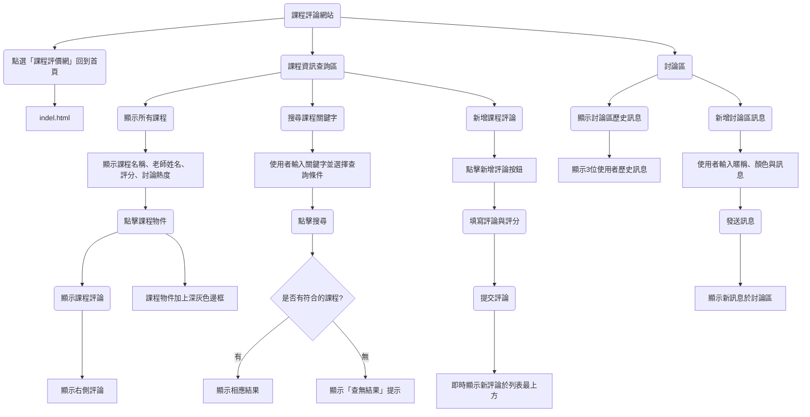

以下是GPT4o生出來的mermaid檔案：

```mermaid
flowchart TD
    A(課程評論網站) --> B(點選「課程評價網」回到首頁)
    B --> C[indel.html]

    A --> D(課程資訊查詢區)
    D --> E(顯示所有課程)
    E --> F[顯示課程名稱、老師姓名、評分、討論熱度]
    
    F --> G(點擊課程物件)
    G --> H(顯示課程評論)
    H --> I[顯示右側評論]
    G --> J[課程物件加上深灰色邊框]

    D --> K(搜尋課程關鍵字)
    K --> L[使用者輸入關鍵字並選擇查詢條件]
    L --> M(點擊搜尋)
    M --> N{是否有符合的課程?}
    N -- 有 --> O[顯示相應結果]
    N -- 無 --> P[顯示「查無結果」提示]

    D --> Q(新增課程評論)
    Q --> R[點擊新增評論按鈕]
    R --> S(填寫評論與評分)
    S --> T(提交評論)
    T --> U[即時顯示新評論於列表最上方]

    A --> V(討論區)
    V --> W(顯示討論區歷史訊息)
    W --> X[顯示3位使用者歷史訊息]
    V --> Y(新增討論區訊息)
    Y --> Z[使用者輸入暱稱、顏色與訊息]
    Z --> AA(發送訊息)
    AA --> BB[顯示新訊息於討論區]
```