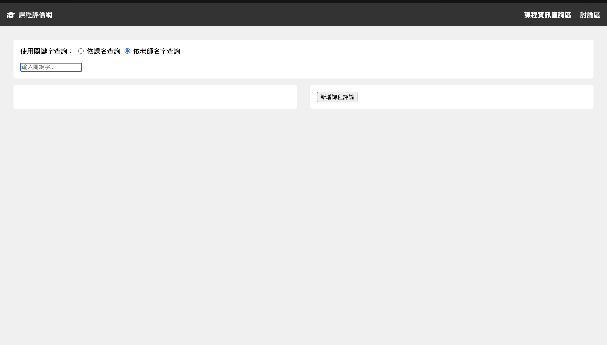
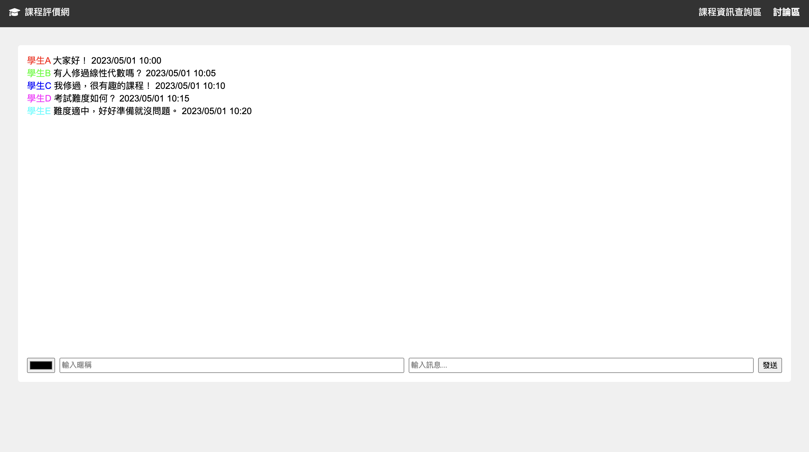

### Prompt 1
幫我照著gherkin.md生出網頁，給我完整程式碼





----

gherkin有很多地方都沒有實作到，像是以下場景：

```
### 場景: 使用關鍵字搜索課程
假設 用戶位於課程資訊查詢區
當 用戶在搜索框輸入關鍵字
而且 選擇"依課名查詢"或"依老師名字查詢"
而且 點擊搜索或按下Enter鍵
那麼 系統應該顯示符合搜索條件的課程列表

### 場景: 查看課程詳細信息
假設 用戶已搜索並看到課程列表
當 用戶點擊某個課程卡片
那麼 該課程卡片應該顯示深灰色外框
而且 頁面右側應顯示該課程的詳細評論信息

### 場景: 添加新的課程評論
假設 用戶正在查看某個課程的詳細信息
當 用戶點擊"新增課程評論"按鈕
那麼 應該顯示評論表單
當 用戶填寫評論內容和評分
而且 點擊"提交"按鈕
那麼 新的評論應該被添加到課程評論列表中
而且 評論列表應該更新，新評論顯示在最上方
```

因此我覺得Claude生code能力不足QQ