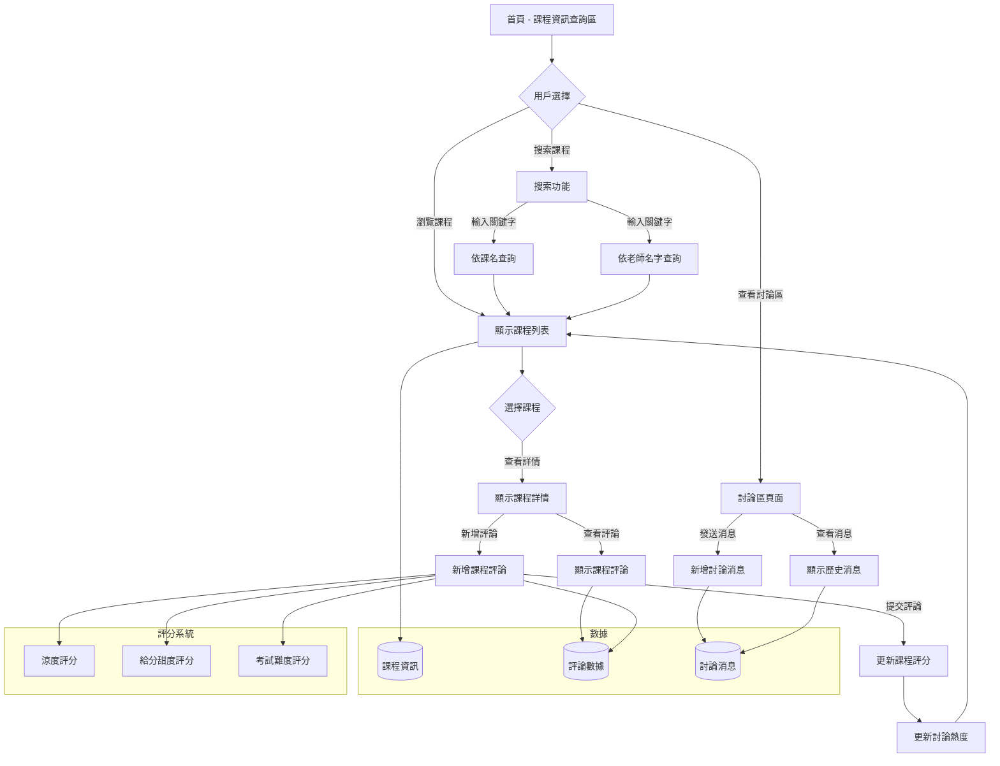

# 生出gherkin階段

### Prompt 1

請照著使用者需求 `user_prompt.md` 生出gherkin檔案

### result 1

```txt
# Language: zh-TW

Feature: 課程評論網站

  Background:
    Given 網站已經載入初始的 fake data
    And fake data 包含至少 6 個課程資訊
    And 每個課程資訊至少有 5 個用戶評論
    And 討論區有至少 3 個不同用戶和 10 則初始訊息

  Scenario: 瀏覽課程資訊查詢區
    When 用戶訪問課程資訊查詢區頁面
    Then 用戶應該看到一個深灰色的 header
    And header 右側應該有 "課程資訊查詢區" 和 "討論區" 兩個選項
    And header 左側應該有一個 icon 和 "課程評價網" 的字樣
    And 頁面主體應該有淺灰色背景
    And 頁面上方應該有一個搜尋框
    And 搜尋框右上方應該有 "依課名查詢" 和 "依老師名字查詢" 的選項
    And 搜尋框左上方應該顯示 "使用關鍵字查詢" 的字樣

  Scenario: 查看課程列表
    When 用戶在課程資訊查詢區
    Then 用戶應該看到左側顯示課程資訊卡片列表
    And 每個卡片應該顯示課程名稱、老師姓名、評分和討論熱度
    And 評分應該包括 "課程涼度"、"給分甜度" 和 "考試難度"
    And 每個評分項目應該用 1 到 5 顆星表示
    And 討論熱度應該用數字和 icon 表示

  Scenario: 查看特定課程評論
    When 用戶點擊一個課程資訊卡片
    Then 該卡片應該顯示深灰色外框
    And 右側應該顯示該課程的詳細評論
    And 右側最上方應該有 "新增課程評論" 按鈕
    And 用戶應該能看到其他用戶對該課程的評論卡片

  Scenario: 新增課程評論
    When 用戶點擊 "新增課程評論" 按鈕
    Then 按鈕應該變為 "顯示課程" 按鈕
    And 用戶應該看到 5 個輸入框：用戶名稱、評論、課程涼度、給分甜度、作業難度
    And 評分項目應該可以通過點擊星星進行選擇
    When 用戶填寫完評論並點擊 "提交" 按鈕
    Then 新評論應該出現在課程評論列表的最上方

  Scenario: 使用搜尋功能
    When 用戶在搜尋框輸入關鍵字
    And 選擇 "依課名查詢" 或 "依老師名字查詢"
    And 點擊搜尋按鈕
    Then 左側課程列表應該更新為符合搜尋條件的課程

  Scenario: 切換到討論區
    When 用戶點擊 header 中的 "討論區" 選項
    Then 頁面應該跳轉到討論區
    And "討論區" 文字應該變亮，"課程資訊查詢區" 文字應該變暗

  Scenario: 在討論區發送消息
    Given 用戶在討論區頁面
    When 用戶選擇顏色、輸入暱稱和消息
    And 點擊發送按鈕或按下 Enter 鍵
    Then 新消息應該出現在聊天室中
    And 新消息應該包含發送時間、用戶暱稱、暱稱顏色和消息內容

  Scenario: 查看討論區歷史消息
    When 用戶進入討論區頁面
    Then 用戶應該能看到之前的歷史消息
    And 消息應該按時間順序排列，最新的消息在底部
```

### Prompt 2

請根據以下需要更正的內容調整gherkin檔案  
1. 請解決js檔fetch不到json檔案的問題 
2. 需要解決點擊新增課程評論的按鈕沒有回應的問題
3. 左側物件和右側物件的card應該要等寬，並且左右對齊 
4. 左側物件要有「課名」、「老師名字」、「涼度評分」、「給分甜度評分」、「考試難度評分」以及「討論熱度」這些資訊，其中三種評分(1分~5分)以星星圖案表示，討論熱度應該是評論數量 
5. 評分使用黃色實心或空心星星顯示

### result 2

```txt
# Language: zh-TW

Feature: 課程評論網站

  作為一名學生
  我想要使用課程評論網站
  以便了解課程資訊和與其他學生交流

  Background:
    Given 網站已正確配置以加載本地 JSON 文件
    And 初始數據包含至少 6 個課程資訊
    And 每個課程至少有 5 個用戶評論
    And 討論區有至少 3 個不同用戶和 10 則初始訊息

  Scenario: 成功加載初始數據
    When 用戶訪問網站
    Then JavaScript 應該能夠成功獲取和解析 JSON 文件
    And 網站應該顯示預加載的課程和評論數據

  Scenario: 瀏覽課程資訊查詢區
    When 用戶訪問課程資訊查詢區頁面
    Then 用戶應該看到一個深灰色的 header
    And header 右側應該有 "課程資訊查詢區" 和 "討論區" 兩個選項
    And "課程資訊查詢區" 選項應該處於激活狀態
    And header 左側應該有一個 icon 和 "課程評價網" 的字樣
    And 頁面主體應該有淺灰色背景
    And 頁面上方應該有一個搜尋框
    And 搜尋框右上方應該有 "依課名查詢" 和 "依老師名字查詢" 的選項
    And 搜尋框左上方應該顯示 "使用關鍵字查詢" 的字樣

  Scenario: 查看課程列表
    Given 用戶在課程資訊查詢區
    When 頁面加載完成
    Then 用戶應該看到左側顯示課程資訊卡片列表
    And 每個卡片應該等寬且左右對齊
    And 每個卡片應該顯示以下資訊：
      | 課名             |
      | 老師名字         |
      | 涼度評分         |
      | 給分甜度評分     |
      | 考試難度評分     |
      | 討論熱度         |
    And 三種評分應該使用 1 到 5 顆黃色星星表示
    And 實心星星表示已獲得的分數，空心星星表示未獲得的分數
    And 討論熱度應該顯示為該課程的評論數量

  Scenario: 查看特定課程評論
    Given 用戶在課程資訊查詢區
    When 用戶點擊一個課程資訊卡片
    Then 該卡片應該顯示深灰色外框
    And 右側應該顯示該課程的詳細評論
    And 右側評論區域應與左側課程列表等寬且對齊
    And 右側最上方應該有 "新增課程評論" 按鈕
    And 用戶應該能看到其他用戶對該課程的評論卡片
    And 評論卡片應該按時間倒序排列，最新的評論在最上方

  Scenario: 新增課程評論
    Given 用戶在特定課程的評論頁面
    When 用戶點擊 "新增課程評論" 按鈕
    Then 評論表單應該顯示出來
    And "新增課程評論" 按鈕應該變為 "顯示課程" 按鈕
    And 用戶應該看到以下輸入欄位：
      | 用戶名稱     |
      | 評論內容     |
      | 涼度評分     |
      | 給分甜度評分 |
      | 考試難度評分 |
    And 評分項目應該可以通過點擊星星進行選擇
    When 用戶填寫完評論並點擊 "提交" 按鈕
    Then 新評論應該出現在課程評論列表的最上方
    And 課程的總體評分應該更新
    And 討論熱度（評論數量）應該增加

  Scenario: 使用搜尋功能
    Given 用戶在課程資訊查詢區
    When 用戶在搜尋框輸入關鍵字
    And 選擇 "依課名查詢" 或 "依老師名字查詢"
    And 點擊搜尋按鈕或按下 Enter 鍵
    Then 左側課程列表應該更新為符合搜尋條件的課程
    And 如果沒有符合條件的課程，應該顯示 "沒有找到符合條件的課程" 的訊息

  Scenario: 切換到討論區
    Given 用戶在課程資訊查詢區
    When 用戶點擊 header 中的 "討論區" 選項
    Then 頁面應該跳轉到討論區
    And "討論區" 文字應該變亮，"課程資訊查詢區" 文字應該變暗
    And 用戶應該看到一個聊天室界面

  Scenario: 在討論區發送消息
    Given 用戶在討論區頁面
    When 用戶選擇顏色
    And 輸入暱稱
    And 輸入消息
    And 點擊發送按鈕或按下 Enter 鍵
    Then 新消息應該出現在聊天室中
    And 新消息應該包含發送時間、用戶暱稱、暱稱顏色和消息內容
    And 聊天室應該自動滾動到最新消息

  Scenario: 查看討論區歷史消息
    Given 用戶進入討論區頁面
    Then 用戶應該能看到之前的歷史消息
    And 消息應該按時間順序排列，最新的消息在底部
    And 每條消息應該顯示發送時間、用戶暱稱和消息內容

  Scenario: 響應式設計
    Given 用戶使用不同尺寸的設備訪問網站
    When 設備尺寸改變
    Then 網站佈局應該自適應調整
    And 左側課程列表和右側評論區域應保持等寬且對齊
    And 所有功能應該在不同尺寸的設備上正常工作

  Scenario: 數據持久化
    Given 用戶添加了新的評論或發送了新的討論消息
    When 用戶刷新頁面
    Then 新添加的評論和討論消息應該仍然存在
    And 所有數據應該保持更新後的狀態

  Scenario: 評分顯示
    Given 用戶查看課程列表或特定課程評論
    Then 所有評分應該使用黃色星星圖案顯示
    And 實心星星表示已獲得的分數
    And 空心星星表示未獲得的分數
    And 每個評分項目應該有 5 顆星星

  Scenario: 討論熱度顯示
    Given 用戶查看課程列表
    Then 每個課程的討論熱度應該顯示為該課程的評論總數
    And 討論熱度應該用數字表示

  Scenario: 確保卡片等寬對齊
    Given 用戶在課程資訊查詢區
    Then 左側的課程資訊卡片應該等寬
    And 右側的評論卡片也應該等寬
    And 左側和右側的卡片寬度應該相等
    And 左右兩側的卡片應該上下對齊
```

----

# 生成網頁階段

### prompt 1

請根據上面gherkin生出完整網頁程式碼

### prompt 2
有錯誤：

1. 點擊右上方的課程評價網需要跳轉到index.html
2. 對於課程資訊查詢區，一開始需要在左邊顯示出課程資訊，對於一個課程資訊要顯示出「課名」、「老師名」、三種「評分」、課程評論熱度，熱度為這堂課的評論數量。
3. 點擊新增課程評論沒有回應
4. 有可能一開始在左邊沒有顯示出課程，有可能是js檔案抓不到json檔，可以考慮把data一到js檔案中

請修正以上錯誤並重新給我完整程式碼

### Prompt 3

有錯誤：

1. 對於每個星星，都以黃色實心或黃色空心的星星顯示
2. 對於課程的討論熱度，數字為課程底下的評論數量

請修正以上錯誤並重新給我完整程式碼

### Prompt 4

有錯誤：

1. 對於每個星星，都以黃色實心或黃色空心的星星顯示
2. 如果某個評分的分數是i分，請讓第1~i的星星為實心黃色星星，其他則為空心黃色星星
3. 在提交評論的區塊中，那些評分的星星可以點擊，點擊到第i個星星，就代表i分，顯示方式跟第二點一樣

請修正以上錯誤並重新給我完整程式碼

## DONE

----

# 生成mermaid階段


### Prompt 1

請根據上面生成的網頁生出mermaid檔案

### result 1



