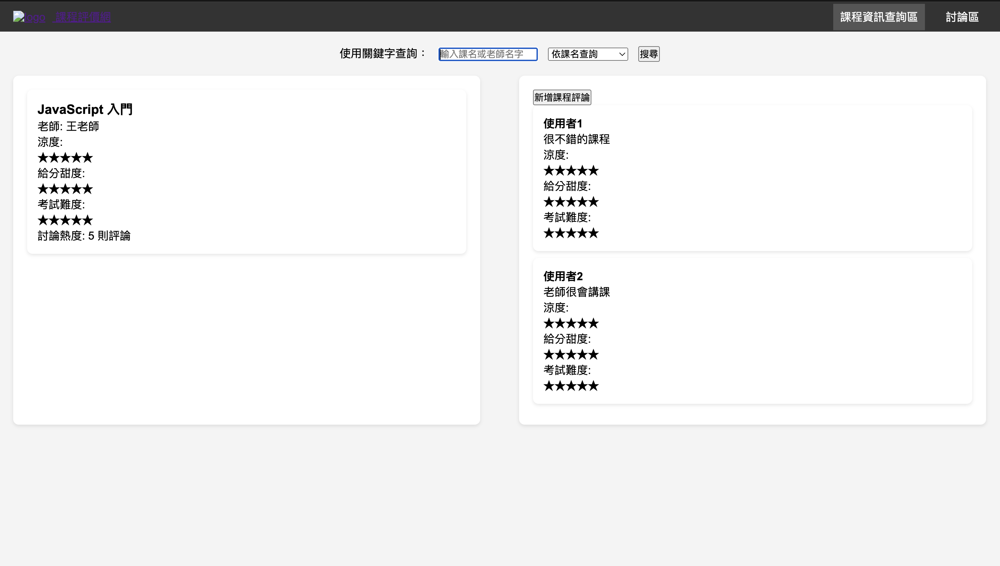
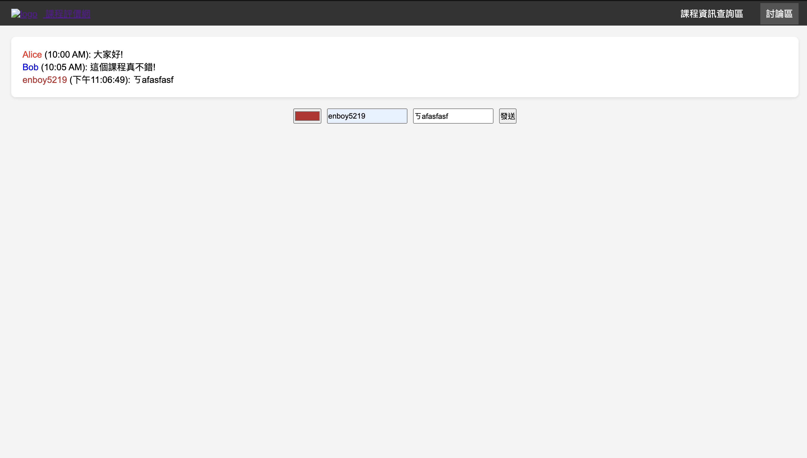
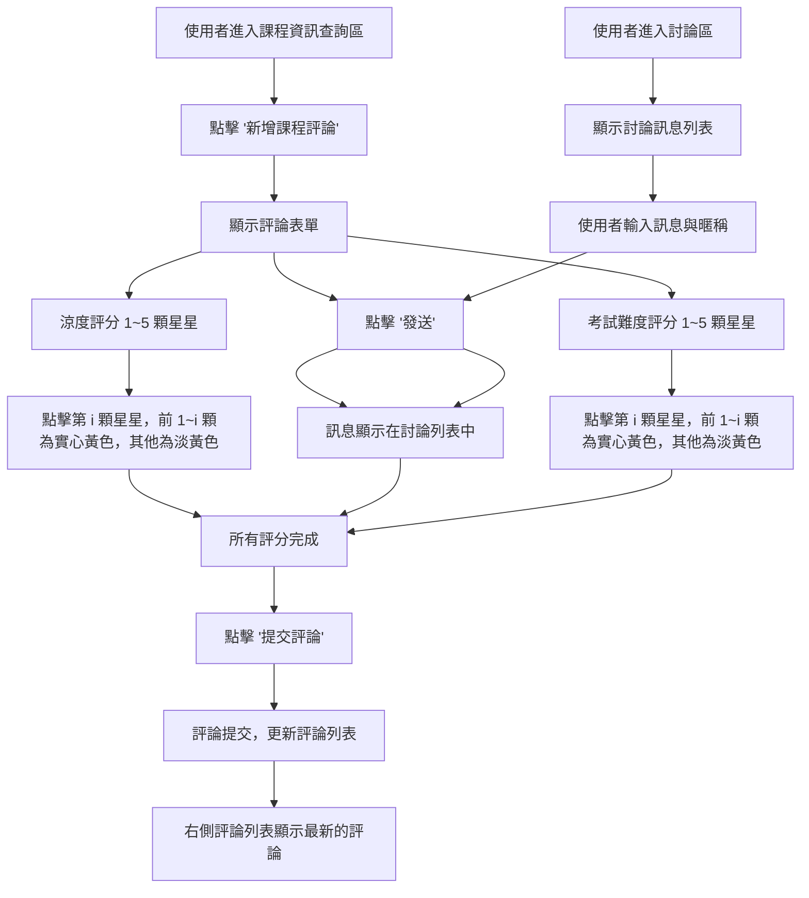

# 生成gherkin階段

### Prompt 1
請照著使用者需求 `user_prompt.md` 生出gherkin檔案

### result 1
```txt
Feature: 課程評論網站

  Scenario: 點選左上角的「課程評價網」回到首頁
    Given 使用者在任何頁面
    When 使用者點擊左上角的「課程評價網」
    Then 使用者將會被導向 indel.html 頁面

  Scenario: 課程資訊查詢區顯示所有課程
    Given 使用者進入「課程資訊查詢區」
    When 頁面加載完成
    Then 左側顯示所有課程的card物件
    And 每個card顯示課程名稱、老師姓名、評分、討論熱度

  Scenario: 點擊某個課程物件顯示其評論
    Given 使用者在「課程資訊查詢區」的課程列表
    When 使用者點擊任意課程card
    Then 該課程的所有評論會在右側顯示
    And 左側該課程的card會加上深灰色邊框作為選中標記

  Scenario: 搜尋課程關鍵字並顯示結果
    Given 使用者在「課程資訊查詢區」
    When 使用者在搜尋框輸入關鍵字
    And 選擇 "依課名查詢" 或 "依老師名字查詢"
    And 點擊搜尋按鈕
    Then 如果 fakeData 裡有符合的課程，應顯示相應結果
    And 如果 fakeData 裡無符合的課程，應顯示「查無結果」提示

  Scenario: 課程評論fakeData資料量不足
    Given 頁面顯示 fakeData 資料
    When 系統加載所有課程數據
    Then 顯示超過 6 個課程物件
    And 每個課程至少有 5 則以上的評論

  Scenario: 新增課程評論按鈕無回應
    Given 使用者點擊「新增課程評論」按鈕
    When 按鈕應該切換至「新增評論」模式
    Then 使用者可以看到輸入框，用於填寫評論
    And 評分部分可點擊選擇星星數量
    When 使用者提交評論
    Then 新增的評論會即時顯示在評論列表最上方

  Scenario: 顯示討論區歷史訊息
    Given 使用者進入「討論區」
    When 討論區頁面加載完成
    Then 顯示至少 3 位不同使用者的歷史訊息
    And 每個訊息顯示時間、使用者暱稱、訊息顏色、訊息內容

  Scenario: 新增討論區訊息
    Given 使用者在「討論區」的訊息輸入框中
    When 使用者輸入訊息顏色、暱稱和訊息內容
    And 點擊發送按鈕或按下 Enter
    Then 新訊息會顯示在討論區
    And 訊息顯示使用者設定的顏色與暱稱
    And 記錄發送的時間
```

### Prompt 2

請根據以下需要更正的內容調整gherkin檔案

1. 討論區的顏色可以自己選，不應侷限在某些特定顏色
2. 新增課程評論輸入框應該要顯示在右側課程資訊card物件之上，且在新增課程評論按鈕之下
3. 左側物件和右側物件的card應該要等寬，並且左右對齊
4. 左側物件要有「課名」、「老師名字」、「涼度評分」、「給分甜度評分」、「考試難度評分」以及「討論熱度」這些資訊，其中三種評分(1分~5分)以星星圖案表示，討論熱度應該是評論數量

### result 2

```txt
Feature: 課程評論網站

  Scenario: 點選左上角的「課程評價網」回到首頁
    Given 使用者在任何頁面
    When 使用者點擊左上角的「課程評價網」
    Then 使用者將會被導向 indel.html 頁面

  Scenario: 課程資訊查詢區顯示所有課程
    Given 使用者進入「課程資訊查詢區」
    When 頁面加載完成
    Then 左側顯示所有課程的card物件
    And 每個card顯示課名、老師名字、涼度評分、給分甜度評分、考試難度評分、討論熱度
    And 涼度評分、給分甜度評分、考試難度評分應以1到5顆星星圖案顯示
    And 討論熱度應顯示評論數量

  Scenario: 點擊某個課程物件顯示其評論
    Given 使用者在「課程資訊查詢區」的課程列表
    When 使用者點擊任意課程card
    Then 該課程的所有評論會在右側顯示
    And 左側該課程的card會加上深灰色邊框作為選中標記
    And 新增課程評論輸入框應該顯示在右側課程資訊的card物件之上，且位於新增課程評論按鈕之下

  Scenario: 搜尋課程關鍵字並顯示結果
    Given 使用者在「課程資訊查詢區」
    When 使用者在搜尋框輸入關鍵字
    And 選擇 "依課名查詢" 或 "依老師名字查詢"
    And 點擊搜尋按鈕
    Then 如果 fakeData 裡有符合的課程，應顯示相應結果
    And 如果 fakeData 裡無符合的課程，應顯示「查無結果」提示

  Scenario: 課程評論fakeData資料量不足
    Given 頁面顯示 fakeData 資料
    When 系統加載所有課程數據
    Then 顯示超過 6 個課程物件
    And 每個課程至少有 5 則以上的評論

  Scenario: 新增課程評論按鈕無回應
    Given 使用者點擊「新增課程評論」按鈕
    When 按鈕應該切換至「新增評論」模式
    Then 使用者可以看到輸入框位於右側課程資訊的card物件之上，且位於新增課程評論按鈕之下
    And 評分部分可點擊選擇星星數量（1到5顆星星顯示）
    When 使用者提交評論
    Then 新增的評論會即時顯示在評論列表最上方

  Scenario: 顯示討論區歷史訊息
    Given 使用者進入「討論區」
    When 討論區頁面加載完成
    Then 顯示至少 3 位不同使用者的歷史訊息
    And 每個訊息顯示時間、使用者暱稱、訊息顏色（使用者可以自訂顏色）、訊息內容

  Scenario: 新增討論區訊息
    Given 使用者在「討論區」的訊息輸入框中
    When 使用者輸入訊息顏色、暱稱和訊息內容
    And 點擊發送按鈕或按下 Enter
    Then 新訊息會顯示在討論區
    And 訊息顯示使用者設定的顏色與暱稱
    And 記錄發送的時間

  Scenario: 左右區域的card物件等寬且對齊
    Given 使用者進入「課程資訊查詢區」
    When 頁面加載完成
    Then 左側的課程資訊card物件和右側的評論card物件應該等寬
    And 左右區域的card應該左右對齊
```

### Prompt 3

請根據以下需要更正的內容調整gherkin檔案

1. 討論區和課程資訊查詢區應該要是兩個html檔案，並且點選左上角的字可以跳轉html頁面

### result 3

```txt
Feature: 課程評論網站

  Scenario: 點選左上角的「課程評價網」回到首頁
    Given 使用者在「課程資訊查詢區」頁面或「討論區」頁面
    When 使用者點擊左上角的「課程評價網」
    Then 使用者將會被導向 index.html 頁面

  Scenario: 課程資訊查詢區顯示所有課程
    Given 使用者進入「課程資訊查詢區」(index.html)
    When 頁面加載完成
    Then 左側顯示所有課程的card物件
    And 每個card顯示課名、老師名字、涼度評分、給分甜度評分、考試難度評分、討論熱度
    And 涼度評分、給分甜度評分、考試難度評分應以1到5顆星星圖案顯示
    And 討論熱度應顯示評論數量

  Scenario: 點擊某個課程物件顯示其評論
    Given 使用者在「課程資訊查詢區」的課程列表
    When 使用者點擊任意課程card
    Then 該課程的所有評論會在右側顯示
    And 左側該課程的card會加上深灰色邊框作為選中標記
    And 新增課程評論輸入框應該顯示在右側課程資訊的card物件之上，且位於新增課程評論按鈕之下

  Scenario: 搜尋課程關鍵字並顯示結果
    Given 使用者在「課程資訊查詢區」(index.html)
    When 使用者在搜尋框輸入關鍵字
    And 選擇 "依課名查詢" 或 "依老師名字查詢"
    And 點擊搜尋按鈕
    Then 如果 fakeData 裡有符合的課程，應顯示相應結果
    And 如果 fakeData 裡無符合的課程，應顯示「查無結果」提示

  Scenario: 課程評論fakeData資料量不足
    Given 頁面顯示 fakeData 資料
    When 系統加載所有課程數據
    Then 顯示超過 6 個課程物件
    And 每個課程至少有 5 則以上的評論

  Scenario: 新增課程評論按鈕無回應
    Given 使用者點擊「新增課程評論」按鈕
    When 按鈕應該切換至「新增評論」模式
    Then 使用者可以看到輸入框位於右側課程資訊的card物件之上，且位於新增課程評論按鈕之下
    And 評分部分可點擊選擇星星數量（1到5顆星星顯示）
    When 使用者提交評論
    Then 新增的評論會即時顯示在評論列表最上方

  Scenario: 顯示討論區歷史訊息
    Given 使用者進入「討論區」(discussion.html)
    When 討論區頁面加載完成
    Then 顯示至少 3 位不同使用者的歷史訊息
    And 每個訊息顯示時間、使用者暱稱、訊息顏色（使用者可以自訂顏色）、訊息內容

  Scenario: 新增討論區訊息
    Given 使用者在「討論區」的訊息輸入框中
    When 使用者輸入訊息顏色、暱稱和訊息內容
    And 點擊發送按鈕或按下 Enter
    Then 新訊息會顯示在討論區
    And 訊息顯示使用者設定的顏色與暱稱
    And 記錄發送的時間

  Scenario: 左右區域的card物件等寬且對齊
    Given 使用者進入「課程資訊查詢區」(index.html)
    When 頁面加載完成
    Then 左側的課程資訊card物件和右側的評論card物件應該等寬
    And 左右區域的card應該左右對齊
```


----

# 生成網頁階段

### Prompt 1
請根據剛剛生的Gherkin檔案生出完整網頁程式碼

### result 1




### Prompt 2

有錯誤：

1. icon請用模擬的icon顯示
2. 左上方的字體顏色換成白色
3. 對於那些課程資訊，請生出更多fakedata
4. 對於評分，請用空心星星和實心星星顯示，並且把顏色換成白色
5. 點擊新增評論按鈕沒有回應

請修正以上錯誤並重新給我完整程式碼


### Prompt 3

有錯誤：

1. 需要更改icon的顏色
2. 把所有星星的顏色以黃色顯示
3. 請生出更多fakedata
4. 課程的討論熱度為右邊討論評論的數量
5. 點擊以關鍵字查詢課程沒有回應

請修正以上錯誤並重新給我完整程式碼


### Prompt 4

有錯誤：

1. 新增課程評論的三種評分應該要可以選擇，以星星的樣式給使用者點擊點擊，例如點擊第三個星星為三分，並且把第一、第二、第三的星星變為實心

請修正以上錯誤並重新給我完整程式碼

### Prompt 5

有錯誤：

1. 新增課程評論的三種評分應該要可以選擇，共有五個星星給使用者點擊點擊，星星跟其他的星星一樣為黃色

請修正以上錯誤並重新給我完整程式碼


### Prompt 6

有錯誤：

1. 新增課程評論的三種評分應該要可以選擇，共有五個星星給使用者點擊點擊，對於一個評分，點擊第i個星星可以使得第1~i個星星為實心黃色星星，其他則為淡色黃色星星，而此評分的分數為i

請修正以上錯誤並重新給我完整程式碼


### DONE

----

# 生成mermaid階段

### Prompt 1

幫我生出這個網頁使用者操作的mermaid檔案，越完整越好


### result 1

```mermaid
graph TD;
    A[使用者進入網站] --> B[顯示課程資訊查詢區];
    
    B --> C1[使用者點擊課程資訊查詢區中的課程卡片];
    C1 --> D1[左側課程卡片標記為選中];
    D1 --> E1[右側顯示該課程的詳細資訊和評論];

    E1 --> F1[點擊 "新增課程評論"];
    F1 --> G1[顯示評論表單];
    G1 --> H1[使用者輸入評論內容];
    H1 --> I1[涼度評分 1~5 顆星星];
    H1 --> J1[給分甜度評分 1~5 顆星星];
    H1 --> K1[考試難度評分 1~5 顆星星];

    I1 --> L1[點擊第 i 顆星星，前 1~i 顆為實心黃色，其他為淡黃色];
    J1 --> M1[點擊第 i 顆星星，前 1~i 顆為實心黃色，其他為淡黃色];
    K1 --> N1[點擊第 i 顆星星，前 1~i 顆為實心黃色，其他為淡黃色];

    L1 --> O1[所有評分完成];
    M1 --> O1;
    N1 --> O1;
    O1 --> P1[點擊 "提交評論"];
    P1 --> Q1[評論提交，更新評論列表];
    Q1 --> R1[右側評論列表顯示最新的評論];

    B --> C2[使用者進行課程搜尋];
    C2 --> D2[輸入關鍵字和選擇篩選條件];
    D2 --> E2[點擊 "搜尋"];
    E2 --> F2[根據關鍵字顯示符合條件的課程卡片];
    F2 --> G2{是否有搜尋結果？};
    G2 -- 有 --> H2[顯示搜尋結果];
    G2 -- 無 --> I2[顯示 "查無結果"];

    B --> C3[使用者點擊討論區];
    C3 --> D3[進入討論區頁面];
    D3 --> E3[顯示歷史討論訊息];
    E3 --> F3[使用者輸入訊息和暱稱];
    F3 --> G3[選擇顏色];
    G3 --> H3[點擊 "發送"];
    H3 --> I3[訊息顯示在討論區訊息列表];

```

### Prompt 2

更改mermaid檔案使得以下錯誤不會發生

Error: Parse error on line 8:
...    E1 --> F1[點擊 "新增課程評論"];    F1 -->
---------------------^
Expecting 'SQE', 'DOUBLECIRCLEEND', 'PE', '-)', 'STADIUMEND', 'SUBROUTINEEND', 'PIPE', 'CYLINDEREND', 'DIAMOND_STOP', 'TAGEND', 'TRAPEND', 'INVTRAPEND', 'UNICODE_TEXT', 'TEXT', 'TAGSTART', got 'STR'

### result 2



# DONE

