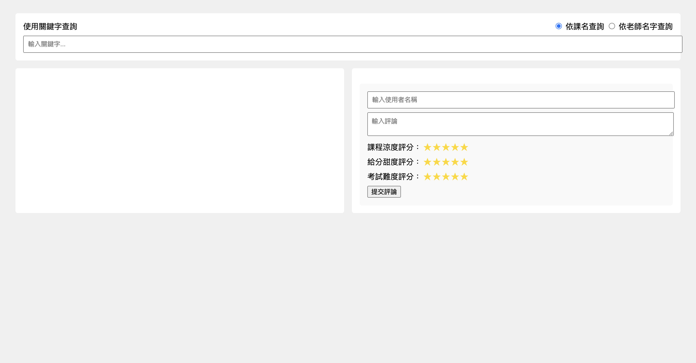

### Prompt 1
幫我照著website_requirement.md生出網頁，給我完整程式碼

### Prompt 2
有些地方地方怪怪的，我舉出了需要修正的部分，請幫我更改並重新給我所有程式碼，json檔除外。

1. 點選左上角的課程評價網可以返回indel.html頁面
2. 對於「課程資訊查詢區」，我希望左邊先出現所有course的物件，點擊某個物件之後，右半邊再顯示出這一堂課程的所有評論
3. 輸入fakeData裡的某堂課名以及選擇依課名查詢，會沒有回應。
4. 新增課程評論按鈕沒有回應。
5. 在查詢頁面，我希望有送出按鈕，點選之後開始用關鍵字搜尋，並在左半邊顯示出所有符合資格的課程。

### Prompt 3

有些地方還是沒有做更改，以下是需要修正的部分，請幫我更改並重新給我所有程式碼。

1. 對於「課程資訊查詢區」，我希望一開始在左邊就先出現所有course的物件，點擊某個物件之後，右半邊再顯示出這一堂課程的所有評論。
2. 輸入關鍵字後，點選送出沒有回應。
3. 按下新增課程評論按鈕，輸入完資料後，點擊提交評論，會沒有任何回應

### Prompt 4
對於course.json，script.js沒有fetch到，請修改相關程式

### Prompt 5
我希望你script.js可以fatch到json檔案並且修正以下錯誤，請給我所有晚整的程式碼。

1. 對於「課程資訊查詢區」，我希望一開始在左邊就先出現所有course的物件，點擊某個物件之後，右半邊再顯示出這一堂課程的所有評論。
2. 輸入關鍵字後，點選送出沒有回應。
3. 按下新增課程評論按鈕，輸入完資料後，點擊提交評論，會沒有任何回應

.....

之後就是他完全讀不懂 Prompt 5的要求，都一直給我爛掉的程式碼。
感覺測下去毫無意義。