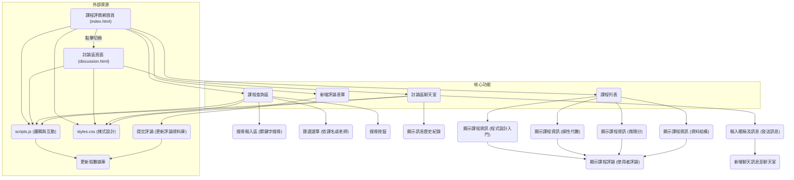

以下是我把完整檔案和我的初始要求，丟給GPT4o生出來的mermaid檔案：

```mermaid
graph TD
    A("課程評價網首頁 (index.html)") -->|點擊切換| B("討論區頁面 (discussion.html)")
    A --> C("課程查詢區")
    C --> D("搜尋輸入區 (關鍵字搜尋)")
    C --> E("篩選選單 (依課名或老師)")
    C --> F("搜尋按鈕")

    A --> G("課程列表")
    G --> H("顯示課程資訊 (程式設計入門)")
    G --> I("顯示課程資訊 (線性代數)")
    G --> J("顯示課程資訊 (微積分)")
    G --> K("顯示課程資訊 (資料結構)")

    H --> L("顯示課程評論 (使用者評論)")
    I --> L
    J --> L
    K --> L

    A --> M("新增評論表單")
    M --> N("提交評論 (更新評論資料庫)")

    B --> O("討論區聊天室")
    O --> P("顯示訊息歷史紀錄")
    O --> Q("輸入暱稱及訊息 (發送訊息)")
    Q --> R("新增聊天訊息至聊天室")

    subgraph "核心功能"
    C
    G
    M
    O
    end

    subgraph "外部資源"
    S("styles.css (樣式設計)")
    T("scripts.js (邏輯與互動)")
    U("fakeData.json (假數據庫)")
    A --> S
    B --> S
    C --> S
    O --> S

    A --> T
    B --> T
    C --> T
    O --> T

    T --> U("讀取假數據庫")
    N --> U("更新假數據庫")
    end
```

ps:你必須要讓圖上的暱稱用小括號包起來。