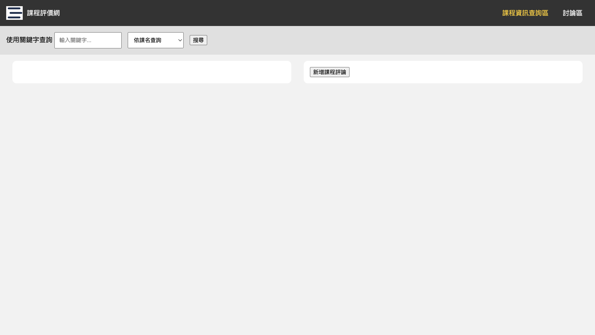
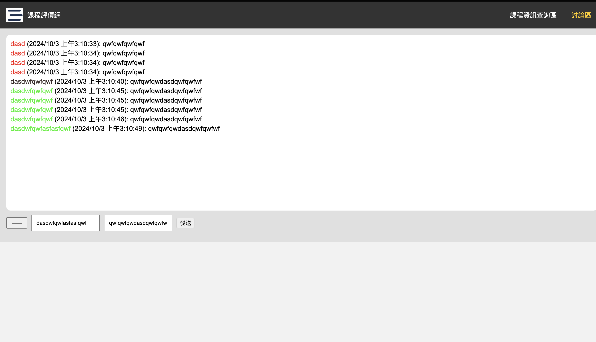
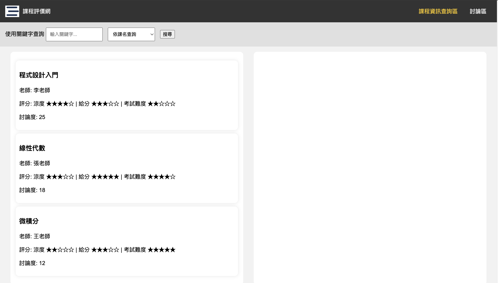
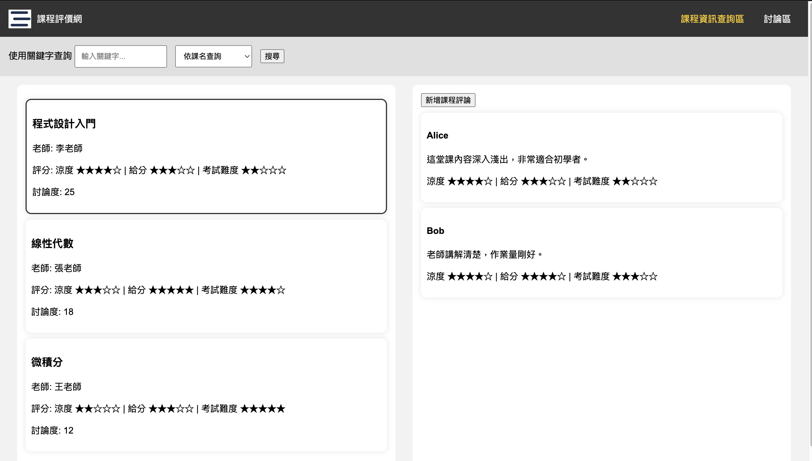
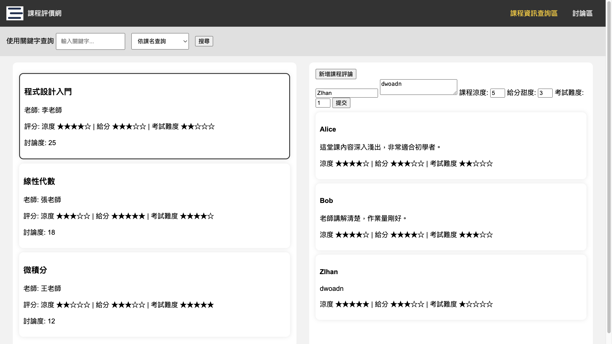
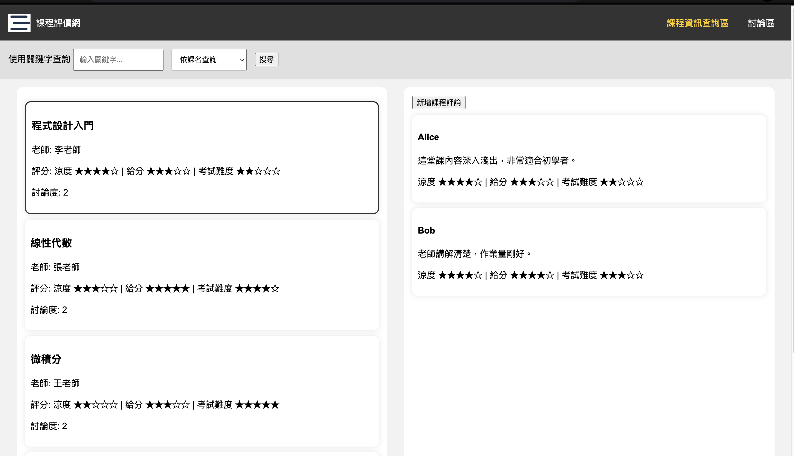

### Prompt 1
幫我照著website_requirement.md生出網頁，給我完整程式碼

### Prompt 2
有些地方地方怪怪的，我舉出了需要修正的部分，請幫我更改並重新給我所有程式碼。

1. 點選左上角的課程評價網可以返回indel.html頁面
2. 對於「課程資訊查詢區」，我希望左邊先出現所有course的物件，點擊某個物件之後，右半邊再顯示出這一堂課程的所有評論
3. 輸入fakeData裡的某堂課名以及選擇依課名查詢，會沒有回應。
4. fakeData裡面的資料不夠多，請生多一點。
5. 新增課程評論按鈕沒有回應。

### Prompt 3

還是有些地方地方怪怪的，我舉出了需要修正的部分，請幫我更改並重新給我所有程式碼。

1. 一堂課程的討論度是根據評論數量而定，像是程式設計入門一開始有兩個學生評論，那這堂課的討論度就是2，請幫我更正所有課程的討論度數量。
2. fakeData裡面的資料不夠多，請幫我生多一點。

除了很醜之外，基本上都有達到prompt要求的功能。